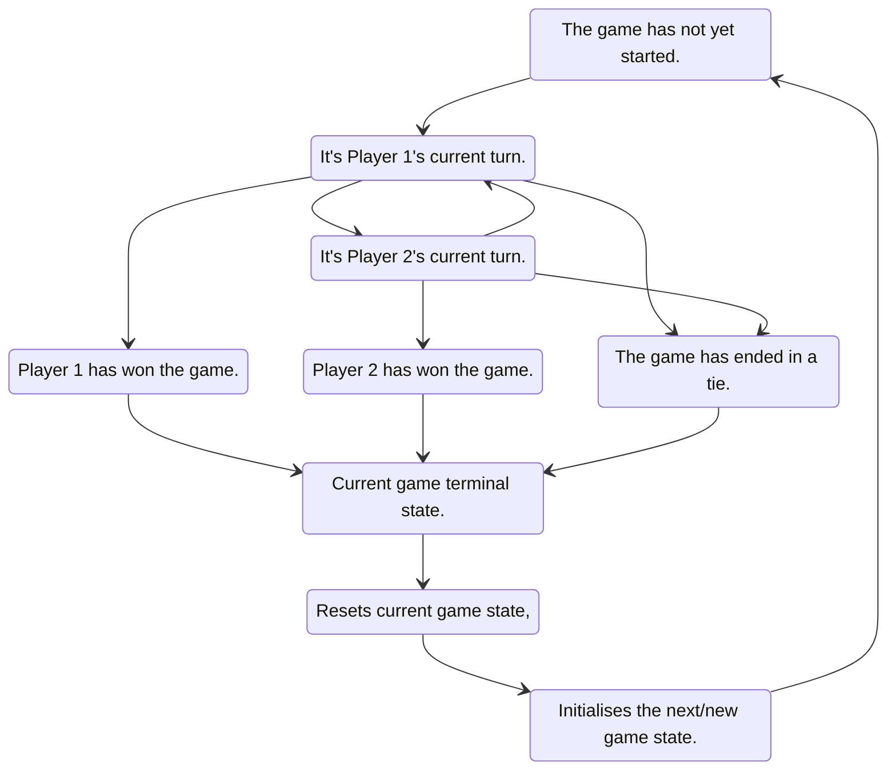
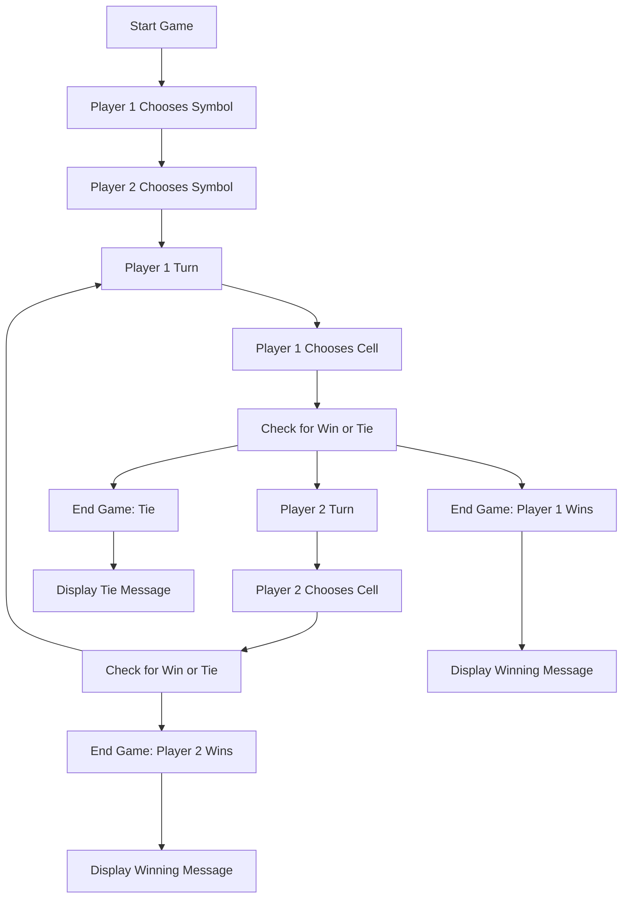
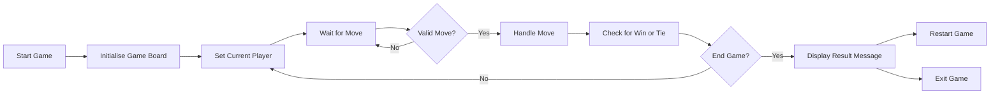

# **3 Grains & Toe**

Three Grains and Toe is a

> Visit: [3 Grains & Toe](https://ipoetdev.github.io/terni-lapilli--toe/ "3 Grains &amp; Toe: <https://ipoetdev.github.io/terni-lapilli--toe/> by Charles J Fowler (@ipoetdev)") | [https://ipoetdev.github.io/terni-lapilli--toe/](https://ipoetdev.github.io/terni-lapilli--toe/)

## **1. Project Goals**

### <ins>Game Rules</ins>

Here are the basic rules of Tic Tac Toe:

- The game is played on a 3x3 grid.
- There are two players, `X` and `O`.
- Players take turns placing their symbol (`X` or `O`) on an empty cell.
- The first player to get three of their symbols (`x3`) in a row (horizontally, vertically, or diagonally) wins the game.
- If all cells on the board are occupied and no player has won, the game is a tie.

> See the State, User Journey and Activity Diagrams below for more information on the implementation of these rules and game flow for each player.

### <ins>Developer Goals</ins>
<!--
 Note: This developer learnt UML and software design by diagrams 20 years ago, under his Masters of Technology at RMIT (CS). This project is a showcase for some of these techniques under the Design section below.
-->

### <ins>User | Audience Goals</ins>

## **2. Plan**

### <ins>User Experience</ins>

### <ins>Audience(s)</ins>

### <ins>Requirements</ins>

1. User Stories

### *<ins>Roadmap</ins>*

## **3. Design (UXD)**

### <ins>Outline</ins>

#### *HTML &amp; CSS*

The game board is created using HTML div elements styled with CSS.

- Each cell on the board is represented by a div element with a data attributes that stores its state, ident, and row, colium and coordinate position on the board.
- The board is styled using CSS Grid to create a 3x3 grid of cells with inner and outer borders, that creates a faux padding around each cell.
- Each cell as relative border radii.

#### _JavaScript_

1. The game logic is implemented using JavaScript [ classes | functions | modules | mix of either ] that represent:
   - the game board, i.e. `GameBoard`.
   - the game players, i.e. `UserMoves`.
   - the game logic, i.e. `GameLogic`

2. The `TicTacToe` [class | function | module | mix of either] game brings
   - all of these components together and
   - handles the user's moves.

3. The `UserMoves` [class | function | module  | mix of either ] are:
   - When the user clicks on a cell.
   - The `handleMove` method is called with the position of  [ row &amp; column | coord | index ] of the cell.
   - Checks if the cell is empty, and if so
     - The `GameBoard` | Board Object is updated with the [ currentplayer's | user's] symbol.
     - The board is [redrawn | updated | refreshed] ...
4. The `GameLogic` [class | function | module  | mix of either ] is checked for
   1. Either a winning move or a tie.
      - If there is a winner, the game is ended. => _Terminal State_
      - If the board is full, the game is ended. => _Terminal State_
   2. Else, the next player is set as the current player. => _Next Move State_

### <ins>State & Activity Flow</ins>

#### _States of the Game_

The state diagram for a game of Tic Tac Toe can be represented with the following states:

- **Start**: The game has not yet started.
- **Player 1 Turn**: Player 1's has a current turn.
- **Player 2 Turn**: Player 2's has a current turn.
- **Player 1 Wins**: Player 1 has won the game.
- **Player 2 Wins**: Player 2 has won the game.
- **Tie Game**: The game has ended in a tie.
- **Restart** can be activated by any Player, and is an alias for **Start** to start a new game, and can be used a a following state from a terminal state

#### _Transition States of the Game_

Each state can transition to other states based on certain conditions. The possible transitions are:

- **Start** can transition to **Player 1 Turn**.
- **Player 1 Turn** can transition to **Player 2 Turn** or **Player 1 Wins** or **Tie Game**.
- **Player 2 Turn** can transition to **Player 1 Turn** or **Player 2 Wins** or **Tie Game**.
- **Player 1 Wins** and **Player 2 Wins** and **Tie Game** are terminal states and cannot transition to any other state in the current game.

#### _State Diagram_

> Mermaid's Text to Diagram

### User Journey

> While the state machine of the game, as respresented by the state diagram. i.e. the game flow logic, above represents the phases of the game logic, the user journey focuses on the user experience during the game flow. They appear identical, just phrased in different ways and contextes.

In this user journey:

- The game starts with both players choosing their symbols.
- Then, the turns alternate between players
  - The turns alternate until one of them wins or the game ends in a tie.
- At each turn, the player chooses a cell to place their symbol in  ...
  - and the game checks for a win or a tie.
- If there is a win, and there is a winner:
  - The game ends and
  - The winning player is declared.
- If the board is full and there is no winner:
  - The game ends in a tie.

### </ins>Activity Diagrams</ins>

> Activity Diagrams are similar to both State and User journies, except they focus on the interations between the user and the game logic, i.e. the game methods/functions.

- **Start Game**: The game is initialized and the game board check for playing readiness (on page load)
  - **Initialise Game Board**: The game board is initialsed by clearing the board/setting up the board with empty cells.
- **Set Current Player**: The game sets the current player to Player 1, and is always X symbol.
  - **Current Player chooses Symbol**: _The game sets the current player to Player 1._
  - **Wait for Move**: _The game waits for the current player to make a move._
  - **Valid Move?**: _The game checks if the move made by the current player is valid._
    - **No**: _If the move made by the current player is not valid, the game returns to waiting for a move from the current player._
- **Handle Move**: If the move is valid, the game updates the game board with the current player's symbol and redraws the game board.
- **Check for Win or Tie**: The game checks if there is a win or tie on the game board.
- **End Game?**: The game checks if the game has ended due to a win or tie.
  - **Display Result**: If the game has ended, the game displays the result to the user (either a win or tie) and prompts the user to either restart or exit the game.
  - **Restart Game**: If the user chooses to restart the game, the game resets the game board and starts a new game.
- **Exit Game**: _If the user chooses to exit the game, the game ends._

_Italics_: Optional Functionality: Methods for the game activities. **MVP++**

#### *<ins>Future Enhancements</ins>*

### <ins>Accessibility</ins>

### *<ins>Graphics</ins>*

#### <ins>Navigation</ins>

#### _Site Intents_

#### _Page Intents_

#### *<ins>Future Enhancements</ins>*

## **4. BUILD**

### **<ins>Environment</ins>**

<!-- > Did not use Gitpod, too high a friction and high context switching costs. -->

***Local***

- VSCode Insiders - Local
- LivePreview
- LiveServer: <http://127.0.0.1>

***Remote***

- Gitpod
- Github Pages from Github.com

### **<ins>Browsers</ins>**

- Google Chrome (Dev) versions 112
- Google Chrome versions 110
- Firefox Developer Edition versions 111.0 beta
- Polypane 13.0.3

### Browser Extensions

> [*] DevTools extensions

- Webhint

### Languages

- HTML5
- CSS3
- Javascript (ES5, Core)

### IDE

> Extensions: A brief summary of a few key ones.

- HTML Language Server (VSCode)
- CSS Language Server (VSCode)
- HTML Validate (html-validate.vscode-html-validate, 2020-2023), version 7.13.2
- ESLint
- Standard
- PostCSS Language Support (CSStools.postCSS), version 1.0.9
- PostCSS Intellisense and Highlighting (vunguyentuan.vscode-postCSS), version 2.0.2
- PostCSS Sorting(mrmlnc.vscode-postCSS-sorting, 2016-2017 (_Last commit: 5 years ago_)), version 3.0.1.

### Repository

<!-- Packages used for developer quality of life and delivery purposes -->

- Javascript (Node, pnpm and npmregistry packages).
- YAML (configuration files for NPM packages)
- C/make for .gitignore and similar ignore files

#### _NPM Plugins_

<!-- These were used during the build but removed prior to submission -->

- Prettier
- Editorconfig
- HTML-validate
- Stylelint
- ESLint
- Standard - 
- PostCSS

### Frameworks Used

> Programs, Packages and Libraries used in different workflows, and where code was generated and then adapted for use in the html or the CSS as a component.

- [Font Squirrels Web Font Generator](https://www.fontsquirrel.com/tools/webfont-generator "Font Squirrel: A free font collection for web safe fonts, within in reason, and request to ask for respect to each font's license"). FAQ: <https://www.fontsquirrel.com/faq>

#### Readme Tooling

- [Mermaid Live Editor](https://mermaid.live/) for Sitemap and Page hierarchy.

#### Design Workflows

- [Balsmiq Desktop](https://balsamiq.com/)

 

## CODE

### Features

## RELIABILITY

## Testing & Verification

### Verification

### Validation

#### _HTML_

|     Page     |  Checked   | Issues           . | Resolved | Passed |
| :----------: | :--------: | :----------------: | :------: | :----: |
|  Home.html   | March 28th |         -          |    -     |   -    |
|  Folio.html  | March 28th |         -          |    -     |   -    |
| Profile.html | March 28th |        - -         |    -     |        |

#### _CSS_

| Page | Checked | Issues           . | Resolved | Passed | Impact | CanIUse |
| :--: | :-----: | :----------------: | :------: | :----: | ------ | ------- |
| Page | Checked | Issues           . | Resolved | Passed | Impact | CanIUse |

#### _JS_

> *<small>DoD 2.1</small>*

- EsLint
- StandardJS, using EsLint rules, as packaged.
- EsLint-config-standard
- EsLint Plugin * dependencies

Steps

- Why Run ESlint: To check syntax, find problems, and enforce code style.
- Type of Modules: Javascript modules (import/export)
- Which framework? None of React or Vue, Core JS only.
- Use typescript? No
- Code runs in? Browser
  -Define a style(guide)
- Use a popular style guide: [Standard: https://github.com/standard/standard](https://github.com/standard/standard)
- File format in: YAML
- Dependencies:
  - eslint-config-standard@latest
  - eslint@^8.0.1
  - eslint-plugin-import@^2.25.2
  - eslint-plugin-n@^2.25.2
  - eslint-plugin-promise@^6.0.0

Using [StandardJs Rule's](https://standardjs.com/) set [Linting Rules](_documentation/linting-rules.md "StandardJS Linting Rules presented/organisted by @iPoetDev"), this project is continually validates syntax, style checks and find problems using this JavaScript linter.

- This linter packages and constrains the multitude if EsLint rules i.e. > 200.
- Bike-shedding is done by StandardJS authors so others don't have to.
- Alternatives style guides are, when running `npx eslint --lint`:
  - AirBnB
  - Google

#### _Lighthouse_

**Conditions**

|     Page     |   Mode   | Device  | Performance | Accessibility | Best Practices | SEO |
| :----------: | :------: | :-----: | :---------: | :-----------: | :------------: | :-: |
|  Home.html   | Snapshot | Desktop |     / 4     |     / 13      |      / 4       | / 7 |
|  Folio.html  | Snapshot | Desktop |             |      /14      |       /4       | /7  |
| Profile.html | Snapshot | Desktop |     / 4     |     / 14      |      / 4       | / 7 |

# DEPLOY

## Features

### Log & Title Bar

### Grid-like Layouts for Content

### Future Enhancements

#### Definition of Done Requirements to be Delivered

See the [Definition of Done-log](_documentation/done.md)

#### *<ins>Code Refactoring</ins>*

## Deployment

- Github & GitHub User Account.
- VSCode with Gitlens.
- Github Pages with a domain of Github.io.

### Repository Service

- Github.com is the remote code repository service being used.
- User account and profile is
  >
  > - `@iPoetDev`
  >
- The repository name is
  >
  > - `terni-lapiil--toei`
  >
- The repository domain URI is
  >
  > - `https://github.com/iPoetDev/terni-lapilli--toe`

### Local Git Service / IDE

- VSCode configured with Github account for Local development environment.
- VSCode extension: Gitlens installed and enabled for local development and deployment.
- Utilized a Changelog format to document the changes, a la, [Keep a Changelog](http://keepachangelog.com/).
  - Intent here was to catalogue in longer more human readable format a more contextual change history. Greater than the 50 chars of a commit 1st line.
  - Additionally, utilized the changelog as a summation effort to shorted and be precise on the commit description.
- Most adhered to [Semantic Versioning](http://semver.org/) approach.
  - Minor adjustment was to put a double digit index for each separate commit if several occurred on one day.

### Deployment Environment

- Github Pages via the inbuilt Github Actions workflows of:
  1. Deploy a static web page off every commit.
  2. Once the commit is built, then deploy the new website and pushes to hosted domain URI.
- Github.io is the hosted domain URI and service.
- The final URI is
  > `https://github.com/iPoetDev/the-folio`

## LAUNCH

### Author Note

### Live Site

In deploying to Github;s website hosting service, GitHub pages, the website was created. The steps to deploy are as follows:

- Login to Github and search for the Github repository 'the-folio' by `@iPoetDev`
- Click on the `Settings` cog icon at the top of the repository.
- Click on `Pages` on the left hand side navigation menu.
- Select `Deploy` from a branch' under `Source` if this is not already selected.
- Under the `Branch` drop down menus, select 'main' and 'root'
- Click `Save`
- Once the page refreshes, the live link should appear underneath the 'Github Pages' title.

The latest version, and prior versions, of the site can be found under the `Actions` tab and in the latest version of the workflow `pages build and deployment` as well as above.

Live link is: [https://ipoetdev.github.io/the-folio/](https://ipoetdev.github.io/the-folio/)

## Assessment

### Credits

#### Design

#### Color

#### Fonts

#### Frameworks/Tooling

## Acknowledgements

### Guides

### Video

- Feross Aboukhadijeh (2018 Feb, 09): "Write Perfect Code With Standard And ESLint - JSConf.Asia 2018". Last Accessed: [https://www.youtube.com/watch?v=kuHfMw8j4xk](https://www.youtube.com/watch?v=kuHfMw8j4xk)
