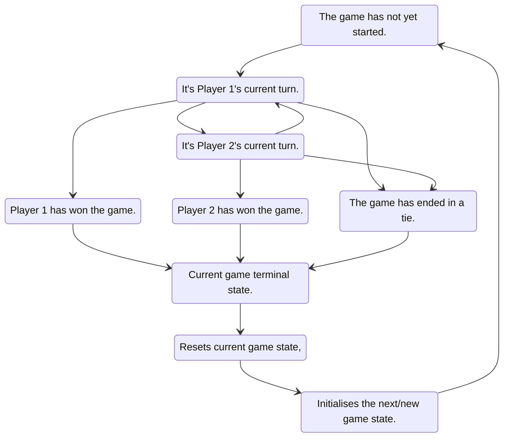
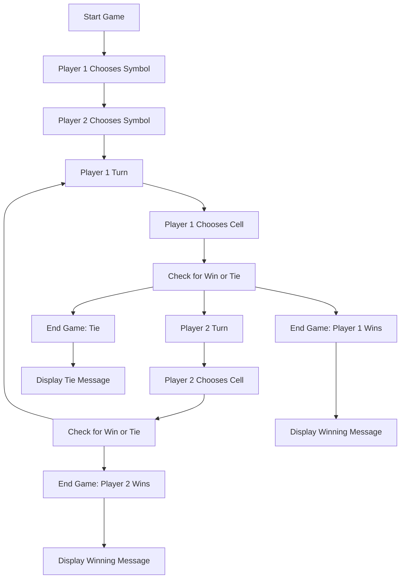
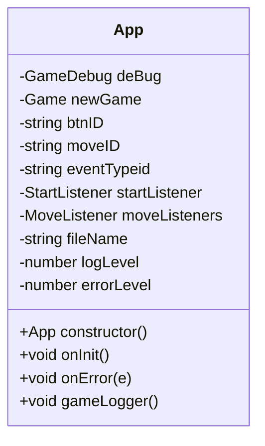
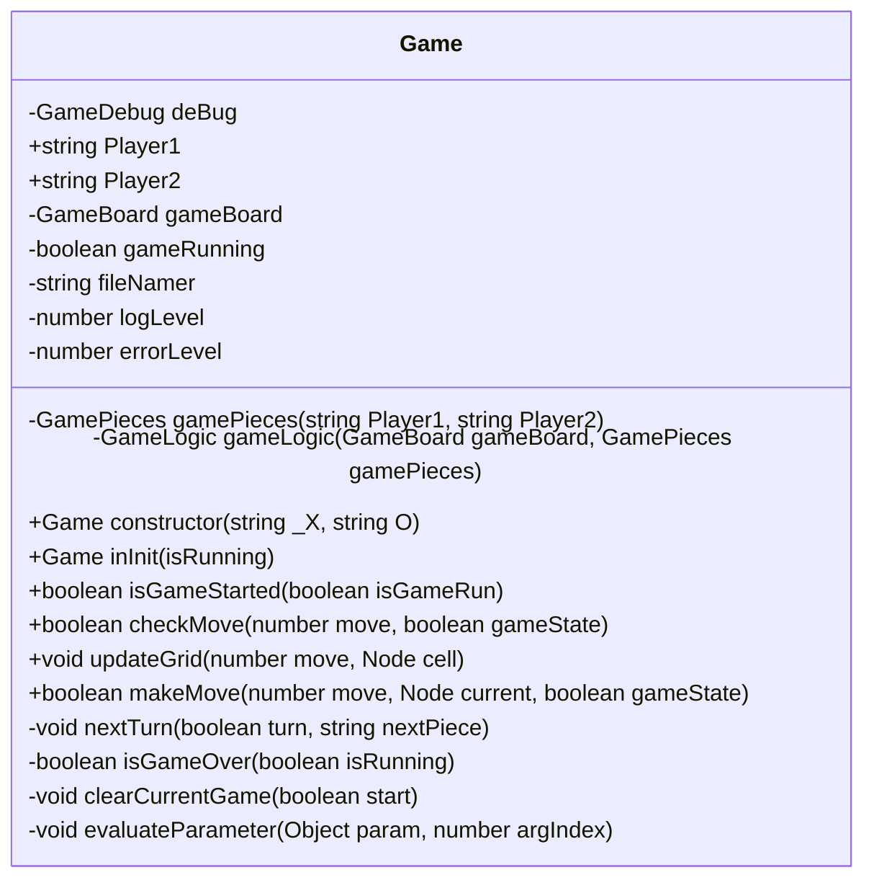
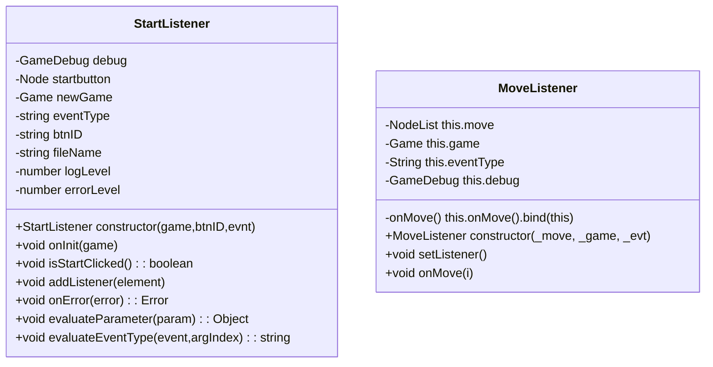
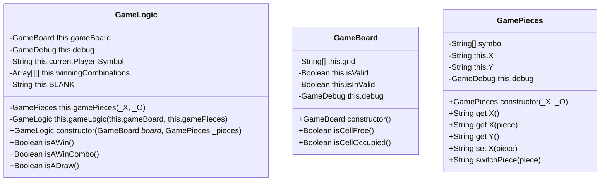
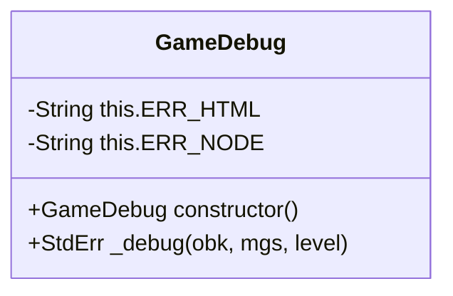

# **</in>Tic Tac & Toe</ins>**

[](https://ui.dev/amiresponsive?url=/ "Visit the Proof of Responsiveness: 3 Grains & Toe")

> Visit: [3 Grains & Toe](https://ipoetdev.github.io/terni-lapilli--toe/ "3 Grains & Toe: <https://ipoetdev.github.io/terni-lapilli--toe/> by Charles J Fowler (@ipoetdev)") | [https://ipoetdev.github.io/terni-lapilli--toe/](https://ipoetdev.github.io/terni-lapilli--toe/)

[](https://github.com/marketplace/actions/super-linter)
[](https://standardjs.com)

---

---

## **1. GOALS/PROPOSAL**

### _<ins>1.1 Game Rules</ins>_

Here are the basic rules of Tic Tac Toe:

- The game is played on a `3x3` grid.
- There are two players, `X` and `O`.
- Players take turns placing their symbol (`X` or `O`) on an empty cell.
- The first player to get three of their symbols (`x3`) in a row (horizontally, vertically, or diagonally) wins the game.
- If all cells on the board are occupied and no player has won, the game is a tie.

### _<ins>1.1 Developer Goals</ins>_

<!--
 Note: This developer learnt UML and software design by diagrams 20 years ago, under his Masters of Technology at RMIT (CS). This project is a showcase for some of these techniques under the Design section below.
-->

- Develop a working MVP version for a game of TicTacToe
- Develop a pattern/model of a codebase that is:
  - Modular and extensibile.
  - Configurable
  - Well documented.
  - Ease of:
    - Readability and analysability.
    - Implementation.
    - Deployment.
  - Well documented usinhg JSDoc-strings
  - Changable: Modular, uses OOP.
  - Stable, and reasonable error control flow.
  - Testible: OOP, Error Handling, Debug
  - Use of GitHub Issues to document and track errorts
- To showcase via this README, not for brevity and concisness, but showcase of my prior art and knowledge of software development (OOP, Technical Documentation, Tooling); given a Masters of Technology [2002-04] qualification.

### _<ins>1.3 User | Audience Goals</ins>_
>
> - DF: Develivered Functionality
> - FE: Future Enhancement

- [DF001](#df001) Play the board game, Tic Tac Toe: Two Player, Two Pieces: (X & O)
  - As a user wants to play a TicTacToe game, so that users can have fun and pass the time.
- [DF002](#df002) Via a simple game of Tic Tac Toe, on a single HTML, via a simple screen, i.e. a Simple Click game logic.
- [DF003](#df003) Implement defensive programming, error control, developer  friendly debugging and user feedback
  - [DF003.01](#df003.01) Use graceful error handling for User & developer alike
  - [DF003.01](#df003.02) Employ configurable debugging functionality as a debugging class for developer experience
  - [DF003.01](#df003.01) Employ simple alterts for error and app level feedback.
- [FE001](#fe001) User(s) choose game pieces, and customise the type of pieces in the process.
- [FE002](#fe002) Game Statistics to keep count of wins, looses, draws for players, keeping track of scores.
- [FE003](#fe003) User can save the game, at any time, and reload the game from the same saved state.
- [FE004](#fe004) User can change the playing difficulty:
  - [DF002](#df002) Level 1) Simple: Human Click (MVP)
  - [FE005](#fe005) Level 2) Medium: Computer (Random)
  - [FE006](#fe006) Level 3) Hard:Computer AI (Minimax)

---

---

## **2. PLAN**

### _<ins>2.1 User Experience</ins>_

1. _Game Objective_: Explains the objective of the game, which is to place three marks in a row, either horizontally, vertically or diagonally.
2. _Game Play_: Instructuions Describe how the game is played. Each player takes turns placing their mark on an empty cell on the game board. The first player to get three marks in a row wins the game.
3. _Game Board_: Inform that a board which is a 3x3 grid surface. Each cell is empty at the start of the game, and players take turns placing their marks on the board.
4. _User Interaction_: Inform how the user interacts with the game, which is by tapping or clicking on an empty cell to place their mark.
5. _Feedback_: Provide feedback to the user after each move, such as highlighting the winning row or reporting that the game has ended in a draw. Additionally, for invalid moves.
6. _Error Feedback_: Provide feedback to the user when the app or the game logic throw an error from user input or from a runtime exception.
    - Provide graceful degradation in error handling and/or ...
    - Provide graceful degradation when logging console errors and/or ...
    - Give the user an option to either i) choose or ii) contact the developer and log a bug.
7. _Restarting the Game_: Allow the user to easily restart the game, either by clicking a button. <!-- or shaking the device. -->

#### _<ins>2.1.1 Audience(s)</ins>_

- _A) Users_:
    > User experience as players
  - who love board games.
  - who like strategic games.
  - who like tatical games.
  - who like similar games to TicTacToe, a 3,3,3-game, an an [m,n,k-game](https://en.wikipedia.org/wiki/M,n,k-game)
- _B) Junior developers_
   > Developer Experience, as a User Experience
  - who are looking to learn javascript.
  - who are looking to learn object orientated programming.
  - who are looking to learn JDDoc commenting for documentation.
  - who are looking to use text to diagram technologies, like mermaid and techniques like UML etc.

#### _<ins>2.1.2 Requirements</ins>_

1. User Stories

#### _<ins>2.1.3 Roadmap</ins>_

1. Week 1: 2023/03/08 - 2023/03/22: Version 0.1.0 - 0.1.6: Initial Code
2. Week 2: 2023/0/22 - 2023/03/24: Version 0.3.0 - 0.3.4
3. Week 3: 2023/03/21 - 2023/03/23: Version 0.4.0 - 0.4.7

---

---

## **3. DESIGN & UXD**

### _<ins>3.1 App Design</ins>_

#### _3.1.1 UI: HTML &amp; CSS_

The game board is created using HTML div elements styled with CSS.

- Each cell on the board is represented by a div element with a data attributes that stores its state, ident, and row, colium and coordinate position on the board.
- The board is styled using CSS Grid to create a 3x3 grid of cells with inner and outer borders, that creates a faux padding around each cell.
- Each cell as relative border radii.

#### _3.1.2 App: JavaScript_

- The game logic is implemented using JavaScript classes, and files using JS modules, that represent:
  - Class: the _App_, i.e. `__App.js`. Initailises the app on page load, and custom event listeners.
    - UI Helper Class: the _StartListener_, i.e. `__StartListener.js`.
      - _StartListener_:
        - Initialises a new Game instance on each button click
    - UI Helper Class: the _MoveListener_, i.e. `__MoveListener.js`.
      - _MoveListener_:
        - Set up the custom listener, and
        - Listens for each click, and
        - Iniialises the move target cell's data and
        - The current game controler on each move.
  - Class: the _Game_, i.e. `__Game.js`. Game controller
    - Class: the _GamePieces_, i.e. `__GamePieces.js`. Game symbol statemachine, and customised pieces storage, as a future enchancement.
    - Class: the _GameLogic_, i.e. `__GameLogic.js`: Logic machine, randomisation and possibly difficulty levels. as a future enchancement.
    - Class: the _GameBoard_, i.e. `__GameBoard.js`: Statemachine for the game 's grid, and, potentially for  local storage, as a future enchancement.
    - Field: Boolean _this.gameRunning_ is the class level activity state
    - Method: Boolean _this.isAWin()_ returns transitory terminal state of the end of the game
    - Method: Boolean _this.isADraw()_ returns transitory terminal state of the end of the game
  - Utility Classes:
    - Class: the _GameDebug_, a debugger, i.e `__GameDebug.js`: Centralised console debugging statements.
      - Each class & method registers a global console informational logging level for positive flow & output.
      - Each class & method registers a global console error logging level for positive flow & output.

### _<ins>3.2 Diagrams</ins>_

#### _3.2.1 States of the Game_

The state diagram for a game of Tic Tac Toe can be represented with the following states:

- _Start_: The game has not yet started.
<!-- - _Player 1 Choose_: Player 1's choose a symbol.
-   _Player 2 Choose_: Player 2's choose a symbol. -->
- _Player 1 Turn_: Player 1's has a current turn.
- _Player 2 Turn_: Player 2's has a current turn.
- _Player 1 Wins_: Player 1 has won the game.
- _Player 2 Wins_: Player 2 has won the game.
- _Tie Game_: The game has ended in a tie.
<!-- - _Save_: can be activated by any Player to save a game state. -->
- _Start_ can be activated by any Player, and is an alias for _Start_ to start a new game,
  - and can be used a a following state from a terminal state

#### _3.2.2 Transition States of the Game_

Each state can transition to other states based on certain conditions. The possible transitions are:

- _Start_ can transition to _Player 1 Turn_.
- _Player 1 Turn_ can transition to _Player 2 Turn_ or _Player 1 Wins_ or _Tie Game_.
- _Player 2 Turn_ can transition to _Player 1 Turn_ or _Player 2 Wins_ or _Tie Game_.
- _Player 1 Wins_ and _Player 2 Wins_ and _Tie Game_ are terminal states and cannot transition to any other state in the current game.

#### _3.2.3 State Diagram_



#### _3.2.4 User Journey_

> While the state machine of the game, as respresented by the state diagram. i.e. the game flow logic, above represents the phases of the game logic, the user journey focuses on the user experience during the game flow.
> They appear identical, just phrased in different ways and contextes.

In this user journey:

- The game starts with both players choosing their symbols.
- Then, the turns alternate between players
  - The turns alternate until one of them wins or the game ends in a tie.
- At each turn, the player chooses a cell to place their symbol in ...
  - and the game checks for a win or a tie.
- If there is a win, and there is a winner:
  - The game ends and
  - The winning player is declared.
- If the board is full and there is no winner:
  - The game ends in a tie.



#### _3.2.5 Code Logic & Activity Flow_

> Activity are similar to both State and User journies, except they focus on the interations between the user and the game logic, i.e. the game methods/functions.

- _Start App_: The app is initialized and the sets ip, for readiness/validity, of UI event listeners (on page load)
  - _Instantiated a New Game_ Create a new game instance
  - _Start StartListener_ Sets up and pass UI & game strings for the start (state) of the game.
  - _Start MoveListener_ Sets up and pass grid UI & game strings after the start (state) of the game.
- _Initialise on Start Button_ Set the start state of the game to truthy, and user click event.
- _Start Game_: A new game is initialized, when game state is true, and game checks for a new game board, game pieces:
  - _Sets the Players's_ To game symbol and pass these to the current game's GamePieces
  - _Initialise Game Pieces_: The game ieces that store each game's pieces and is responsible for switching pieces on each turn.
  - _Initialise Game Board_: The game board is initialsed by clearing the board/setting up the board with empty cells.
  - _Initialise Game Logic_: The game logic is checked and initialised .
- _On Each User's Click_: The onClick checks for
  - _Try Again_ When Grid's cell is occupied, then inform the user to try again.
  - _Available to Move_ When Grid cell is free, the game is actively running, and the end state is not true
    - _Update Grid on Move_: Update the Grid
  - _Ready to Finish_ When the game is not running, and the end state is true
    - _Update Grid at End_: Update the grid/ui and game's state at end of the game.
- _Makes a Move_: Per click, per move, make a move
  - _Checks Valid Move_ Inspects for a valid move
  - _Update Game State_ Sets game active state to true
  - _Update Playing Piece_ Fetch the current playing piece
  - _Check Game Over_ Checks for game terminal state, win or draw or continue.
- _Check for Win or Tie_: The game checks if there is a win or tie on the game board. If true, then ...
  - _End Game?_: The game checks if the game has ended due to a win or tie.
    - _Display Result_: If the game has ended, the game displays the result to the user (either a win or tie) and prompts the user to either restart or exit the game.
        <!-- - _Prompt to Restart_: User is offered to start a new game, or end game.  -->
  - _Restart Game_: If the user chooses to start a new game, then
    - _Reset Game Board_ game resets the game board and starts a new game.
- _Exit Game_: _If the user chooses to exit the game, the game ends._

_Italics_: Optional Functionality: Methods for the game activities. _MVP++_

#### _3.2.6 Class Diagram_

##### _3.2.6.1 App



##### _3.2.6.2 Game Controlers



> Note: Optional param with defaults: log & locname excluded for clarity

##### _3.2.6.3 UI Controlers



##### _3.2.6.4 Game Classes/Logic_



##### _3.2.6.5 Ultility Classes_



#### _3.2.7 Code Flow_

- [Mermaid Live Editor: Tic Tac Toe](https://mermaid.live/edit#pako:eNqFVGFv2jAQ_SsnV51AChmEUog1TaJkLZVAnUqqSVO-mMRQr8GObKctLf3vc-wAa6EafEh8fvfu3vPFrygVGUUYtVqthGumc4ohZmlM0lhQuCIrCsOigJFBwWUunhJukUtJinuIo4SD-Z2eAsNwp1nO9BpGOVEK29yR4Au2xOCepSSaCQ5KS8aX4HJZYw9s7uguMAznBkdSbYgVlV-jmymQOlSRLIR0G-N4Oqm5LhpV5IuBNqHV-r65KLU20BaczDSR2nTG0ocNjBp2OWFKU05lE_6jIqLz0olQIqf-LI5u7uLNLL79cXvbaMJ8bZwhS-i02rUkp8mm7SWNMLwri8G9KStF2QbnruETu_Igrfp1BAc9V_rurqGWmBgUfaR8B9jAsGEOzv-j9h0McXWWPuNMN5oYrs2TEU0ze8KGRN9TKMiSQi5IdtzRX4xn4kn5N7zCfF4EO_-A2Ro5e6HK0i-rgSI8A0W1grJwTUNed618x3NIawZiKh7pcfNWZgf8lOa5emfax-4rBjMN_sggt8MQNf7lrQt-CG7NjtjjodPqwIWjZyW4DW7gyg7HO3FXbs52pimQVBVm3Ng8p1ZhKriWIs-r72bno1jsP9UPvsE3U_Og1DFZglexw7bc2hFtxkRBAAWjKTVyL-3WT7uq0Zeu4ORIrhkZDyJJnjyIS8k3MLG7E7FkaZ09_jzb3kDmc9DUA1XKBUlNr2OLmAsiM8Ow_QMgD62oXBGWmRvttYokyLi1ognC5jUj8iFBCX8zOFJqMVvzFGEtS-qhsshMjYgRc7OtEF6QXJloQfhvIVZbEM2YFnLqbkx7cVoIwq_oGeHOWej3g2AQ9HqDbjfshR5aI3zu98Og2wnOBkH7POyd93pvHnqxpG0_HHT6QbsbGHw7DLv9t7_TH78u)
- [PNG | Live](https://mermaid.ink/img/pako:eNqFVGFv2jAQ_SsnV51AChmEUog1TaJkLZVAnUqqSVO-mMRQr8GObKctLf3vc-wAa6EafEh8fvfu3vPFrygVGUUYtVqthGumc4ohZmlM0lhQuCIrCsOigJFBwWUunhJukUtJinuIo4SD-Z2eAsNwp1nO9BpGOVEK29yR4Au2xOCepSSaCQ5KS8aX4HJZYw9s7uguMAznBkdSbYgVlV-jmymQOlSRLIR0G-N4Oqm5LhpV5IuBNqHV-r65KLU20BaczDSR2nTG0ocNjBp2OWFKU05lE_6jIqLz0olQIqf-LI5u7uLNLL79cXvbaMJ8bZwhS-i02rUkp8mm7SWNMLwri8G9KStF2QbnruETu_Igrfp1BAc9V_rurqGWmBgUfaR8B9jAsGEOzv-j9h0McXWWPuNMN5oYrs2TEU0ze8KGRN9TKMiSQi5IdtzRX4xn4kn5N7zCfF4EO_-A2Ro5e6HK0i-rgSI8A0W1grJwTUNed618x3NIawZiKh7pcfNWZgf8lOa5emfax-4rBjMN_sggt8MQNf7lrQt-CG7NjtjjodPqwIWjZyW4DW7gyg7HO3FXbs52pimQVBVm3Ng8p1ZhKriWIs-r72bno1jsP9UPvsE3U_Og1DFZglexw7bc2hFtxkRBAAWjKTVyL-3WT7uq0Zeu4ORIrhkZDyJJnjyIS8k3MLG7E7FkaZ09_jzb3kDmc9DUA1XKBUlNr2OLmAsiM8Ow_QMgD62oXBGWmRvttYokyLi1ognC5jUj8iFBCX8zOFJqMVvzFGEtS-qhsshMjYgRc7OtEF6QXJloQfhvIVZbEM2YFnLqbkx7cVoIwq_oGeHOWej3g2AQ9HqDbjfshR5aI3zu98Og2wnOBkH7POyd93pvHnqxpG0_HHT6QbsbGHw7DLv9t7_TH78u?type=png)
- 

### _<ins>3.3 Accessibility</ins>_

### _<ins>3.4 Graphics</ins>_

---
---

## **4 BUILD**

### _<ins>4.1 Environment</ins>_

<!-- > Did not use Gitpod, too high a friction and high context switching costs. -->

1. _**Local**_

- VSCode 1.76-1.77.1
- LiveServer: <http://127.0.0.1:3001>

1. _**Remote**_

- Github Pages from Github.com

### _<ins>4.2 Browsers</ins>_

- MS Edge (Dev) versions 110-113
- MS Edge versions 111
- Google Chrome (Dev) versions 112
- Google Chrome versions 110-111
- Firefox Developer Edition versions 111.0 beta
- Polypane 13.0.3

### _<ins>4.3 Browser Extensions</ins>_

> <sub>[*] DevTools extensions</sub>

- Webhint

### _<ins>4.4 Languages<ins>_

- HTML5
- CSS3
- Javascript (ES6, Core)
  - No backward compatibility accounted for.

### _<ins>4.5 IDE</ins>_

> Extensions: A brief summary of a few key ones.

- HTML Language Server (VSCode)
- CSS Language Server (VSCode)
- HTML Validate (html-validate.vscode-html-validate, 2020-2023), version 7.13.2
- ESLint & Eslint.yml
- JS42
- Markdownlint
- SonarLint
- Quokka.js
- Wallaby.js
- Mermaid
- Raycast Screenshots

### _<ins>4.6 Repository<ins>_

<!-- Packages used for developer quality of life and delivery purposes -->

- Javascript (Node, pnpm and npmregistry packages).
- YAML (configuration files for NPM packages)
- C/make for .gitignore and similar ignore files

#### _4.6.1 NPM Plugins_

<!-- These were used during the build but removed prior to submission -->

- Prettier
- HTML-validate
- ESLint & Eslint.yml
- Markdownlint-cli2
- Sonarlint
- Webhint
- JSDoc
- JS42

### _<ins>4.7 Frameworks Used</ins>_

> Programs, Packages and Libraries used in different workflows, and where code was generated and then adapted for use in the html or the CSS as a component.

#### _4.7.1 Readme Tooling_

- [Mermaid Live Editor](https://mermaid.live/) for Sitemap and Page hierarchy.
- [Draw.io](https://draw.io/) for Class Diagrams and documentation.

#### _4.7.2 Design Workflows_

- [Balsmiq Desktop](https://balsamiq.com/)

---

## **5. CODE**

### _<ins>5.1 Features</ins>_

- ES6 Javascript with Class statement
- ES6 Import/Export Module statements
  - <https://www.infoworld.com/article/3619560/7-tools-transforming-javascript-development.html>
- Single constructor classes
- Single responsibility clases, with a few short functions
- UI Helper Classes, for wrapping error handling of DOM events.
- Utility classes for auxillary classes for debugging and configuration (strings) tasks.
- `Try ... Catch` blocks for error handling.
- Attempted low coupling, and high cohession, but there are a few high coupling dependencys due to state of the game and passing objects inside objects from app/UI to game logic tier.
- Functions Styles
  - [Closures](https://developer.mozilla.org/en-US/docs/Web/JavaScript/Closures): A closure is the combination of a function bundled together (enclosed) with references to its surrounding state (the lexical environment).
    - In `GameLogic.isAWin`, `isWinninngCombo` is a closure
  - IIFE - [Immediate InvokeďFunction Expressions](https://developer.mozilla.org/en-US/docs/Glossary/IIFE)
    - `StartListener.onError().errorMessage` & `MoveListener.onError().errorMessage` is a IIFE exmaple.
  - Arrow Functons
- _Object literals and Map Object literals_
  - Alternative use case to `Switch..Case` state.
  - Object literals provide a more concise and readable way of organizing code.
  - Better if multiple options have a multiple key but more complex evaluating expressions
  - Used in evaluating multiple input Parameters/EventTypes is `Game.js`, `GameLogic.js`, `MoveListener.js`, `StartListener.js` instead of length switch statements, can can employ default states too.
- _Destructurting_
  - Possible opportunity in `GameLogic.isAWin.isWinningCombo` but not yet implemented.
  - Additionally, possible refactoring in `MoveListener.onClick` for the div's cell node attribute and values.
      - - _Nullish coallesing Operator_ in lieu of less readable `!== null` and `!== undefined` conditional expressions.

### _<ins>5.2 Code Patterns</ins>_

- _Class based OOP_, using Javascript ES6/2015 modules, as opposed to Javascript prototypal OOP.
  - No inhiertiance employed for MVP
  - Class members have just enough default values, so not to cause errors on instantiation
- _JSDoc_, expressive, for
  - Documentation for maintainabiliy
  - Versioning, SemVer, for method versioning bummping, and changelog notes
  - Type checking, using IDE and Typscript language server, without compling.
    - In pure Javascreipt, employ Typescript linting for types, without compling, using JSDoc and IDE linting and validation
- _JSDoc_ documenting the following file/module organisation
  - 001: Module JSDoc
  - 002: Class Definition JSDoc
  - 003: Declarations: Class Members JSDoc
  - 003: Constructor: Class Constructor JSDoc
  - 004-00n: Class Functions & Methods JSDoc
- _Message & Trace_: Separating string and string tenplate literals into their own const block level declarations and not inline to function code (for console.log, or this.deBug._debug(), and Error messages)
- _Embed Debugging_: Instead of litering code with console.log, which is a anti-pattern and against assessment criteria, embed debugging, logging and possibiliy unit testing as a feature of the code, not as a developer convinence.
  - This is contrary to the assessment criteria, so instead of removing console.log API, embed it and employ it for improved maintainability.
  - Created a debugging interface class, and encapsulated all the formating to browser/IDE console to STDOUT, STDWARN, STDERR
  - Employ an extensible interface for debugging as complexity of code increase
  - Have interface for testing, and improved developer experience
- _Embed logging and error_ tracing levels into method signatures, as an optional default
- _Embed method name_ and call tracing in method signatures, as an optional default.
- _Named CONSTANTS_ variable names along with the `const` keyword for readability, and consistency, when hoisted higher in a block of code, say at start of the function/class method.
  - Improved opportunity to refactor and change the constant value systems. i.e Boolean state or String State or Number states.
- _Double Logic Gates_ Used to track the long running state of a instance, and the terminal event state of the instance purpose, i.e. a Game. These are opposing values, in a double logic gate.

### _<ins>5.3 Comment Style</ins>_

> Uses JSDoc docstrings for code comment
> Uses In `//` for single line comments

- This project is an evaluation level project for assessment and code review purposes, as such high level decision was made, with trade offs, for the following reasons:

  1. Be explicit as possible, when using the JSDoc strings below,
  2. Be precise as possible
  3. Be declarative as possible
  4. Be easy to follow, thought the LoC count rises for each file as comments are equal or comparable LoC as to effective code.
  5. This has the consequences of reducing readability over all
  6. This has the consequneces of increasing the maintenance budget
  7. This has the consequences of of increasing file size and download times, particularly on P75 user devices and or slower networks.
  8. This has the benefit of improving comprehension of code effectiveness and execution for code review purposes.

- This code is not for production, but for evaluation only, as in production level code, the commenting & docstrings would be:

  1. Be less explict, descriptive, more terse.
  2. Just enough to decribe the purpose of the code statement or code block.
  3. Allow for code to be self commenting
  4. Efficient for code file size
  5. Efficient for performance purposes
  6. Used in time for using automated API/Documenting solutuons
  7. Minifified or refactord/edited downwards.
  8. In production, there would be a common house style that all engineers would be able requred to follow.

- It is the author's style to be expansive during development.
- Author would strip out code comments in a CI/CD just before pushing the code into production , but after QA and the technical writers have captured the code comments, in a minification and code file reducation as this expansive documentation has a high LoC

## **6. RELIABILITY**

### _<ins>6.1 Testing & Verification</ins>_

- Static Analysis like linting, code formaters, autocomplete/correction
  - JS42.ai for inline refactoring and code hint
  - ESlint and Prettier
- IDE Run & Debugging: VSCode `F5` configured with the following tasks
  - `Debugger for Firefox`
  - `Microsoft Edge Tools for VS Code`
  - `Chrome Debugger`
- IDE Typescript Linting & Language Server with ErrorLens extension
  - Good at identifying code hotspots at a higher stands
  - Inline error hinting, and @ts-ignore/@ts-check annotations
  - Do not have to complie TS rto have benefits on code quality in IDE.
- Dyanmic Analysis
  - `Quokka.js`, with `Wallaby.js`
    - Runtime values are updated and displayed in your IDE next to your code,
    - Runs your JavaScript and TypeScript tests immediately as you type, highlighting results in your IDE

### _<ins>6.2 Validation</ins>_

#### _6.2.1 HTML_

|     Page     |  Checked   | Issues . | Resolved | Passed |
| :----------: | :--------: | :------: | :------: | :----: |
|  Index.html   | March 28th |    -     |    -     |   -    |

#### _6.2.2 CSS_

| Page  | Checked | Issues . | Resolved | Passed | Impact | CanIUse |
| :---: | :-----: | :------: | :------: | :----: | ------ | ------- |
| Page  | Checked | Issues . | Resolved | Passed | Impact | CanIUse |

### _<ins>6.3 Static Analysis</ins>_

#### _6.3.1 JavaScript Linters, Formaters_

- EsLint
  - EsLint-config-standard
  - EsLint Plugin \* dependencies
- JS42.ai
- SonarLint
- VSCode's Javascript Langauge Server
- VSCode's Typescript Langauge Server

#### _6.3.2 Dynamic Analysis_

- `Quokka.js` [Pro]: Runtime values are updated and displayed in your IDE next to your code, as you type. This allows for dynamic errors, senior partner to checking the browser's console.
  - This enaable faster prototyping, learning and testing by being able to display and explore runtime values without having to modify the code.
  - Can breakpoint, limited and step into code with TimeMachine feature.
- `Wallaby.js` is a developer tool that runs your JavaScript and TypeScript tests immediately as you type, highlighting results in your IDE right next to your code.
  - From same developer as Quokka.js, some overlap in functionality.

#### _6.3.3 Lighthouse_

**Conditions**

|   Page    |   Mode   | Device  | Performance | Accessibility | Best Practices |  SEO  |
| :-------: | :------: | :-----: | :---------: | :-----------: | :------------: | :---: |
| Home.html | Snapshot | Desktop |     / 4     |     / 13      |      / 4       |  / 7  |

---

---

## **7. DEPLOY**

> Uss Gherkin syntax for code based Feature definitions

### <ins>7.1 Features</ins>

> Gherkin / Cumcumber syntax

#### **<ins>7.1.1. App.js: App</ins>**

##### _7.1.1.1 [DF001](#df001)_

```gherkin
DF001:
Feature: TicTacToe Game -
  A Board Game: Two Player, Two Pieces: (X & O)
  As a user, I want to play a TicTacToe game ...
  So that I can have fun and pass the time.
```

```gherkin
DF001.A:
Scenario: Start a new game
  Given I am on the game page
  When I click on the start button first
  Then the game board is enabled
   And the first player is prompted to make a move
```

```gherkin
DF001.A.ii:
Scenario: Start a new game
  Given I am on the game page
  When I click on grid first before start button
    And the start button is not clicked first
  Then the game does  throw an error
   And the app handles the error gracefully
   And I, as the user, is prompted to click the start button
   And the user is invited, as the first player, is prompted to make a move
```

```gherkin
DF001.B:
Scenario: Make a move
  Given I am on the game board
  When it is my turn to make a move
    And I click on an empty cell on the board
  Then the cell is filled with my pieces (X or O)
    And the turn is passed to the other player
```

```gherkin
DF001.C:
Scenario: Win the game
  Given I am playing TicTacToe
    And it is my turn to make a move
    And I have two of my pieces in a row or column
  When I make a move that creates a row or column of three of my pieces
  Then I win the game
    And the game ends
```

```gherkin
DF001.D:
Scenario: Tie the game
  Given I am playing TicTacToe
    And it is my turn to make a move
    And there are no more empty cells on the board
  When I make a move
  Then the game ends in a tie
```

#### **<ins>7.1.2  Game.js: Game</ins>**

##### _7.1.2.1 [DF002](#df002)_

```gherkin
DF002:
Feature: Game Controller class for the game of TicTacToe
```

```gherkin
DF002.A:
Scenario: Making a move
  Given a game board and a set of game pieces
    When a move is made by a player
  Then the move is assigned to the board ...
    And the next player's turn is initiated
```

```gherkin
DF002.B:
Scenario: Checking for a win or draw
  Given a game board and a set of game pieces
    When a player makes a move
  Then the game logic checks for a win or draw
    And if there is a win or draw, the game is reset for a new round
```

```gherkin
DF002.C:
Scenario: Resetting the board
  Given a game board and a set of game pieces
    When the game is reset
  Then the board is cleared ...
    And the game is returned to its initial state for a new round
```

#### **<ins>7.1.3 GameLogic.js: GameLogic</ins>**

```gherkin
DF002:
Feature: Game Logic: Simple Level (MVP)
```

```gherkin
DF002.D:
Scenario: Game is won
  Given a tic tac toe game is in progress
    And the current player completes a winning combination
  When the winning move is evaluated
  Then the game is to be won
    And the winner is announced
    # And the game state could be logged
```

```gherkin
DF002.E:
Scenario: Game is a draw
  Given a tic tac toe game is in progress
    And all cells on the board are occupied
  When the board is evaluated
  Then the game is to be a draw
    And the draw is announced
    # And the game state could be logged
```

- ***Helper Classes***: `StartListener`, `MoveListener` not documented here, see [here]() for full schema, as these are auxiliary to the core intent of the app.
- ***Utility Classes***: `GameDebug`, `GameConfig` not documented here, see [here]() for full schema, as these are utilities to aid the running of the app.

#### _<ins>7.1.4  Future Enhancements</ins>_

##### _7.1.4.1 FE001](#fe001)_

```gherkin
  FE001. Feature: User(s) choose game pieces, and customise the type of pieces in the process
```

##### _7.1.4.2 [FE002](#fe002)_

```gherkin
  FE002. Feature: Game Statistics to keep count of wins, looses, draws for players, keeping track of scores.
```

##### _7.1.4.3 [FE003](#fe003)_

```gherkin
  FE003. Feature: User can save the game, at any time, and reload the game from the same saved state.
```

##### _7.1.4.4 [FE004](#fe004)_

```gherkin
  FE004. Feature: Change the playing difficulty: Simple (Click), Medium (Random), & AI (Minimax)
```

### _7.2  Definition of Done Requirements to be Delivered_

See the [Definition of Done-log](_documentation/done.md)

---

### **7.3 Deployment**

- Github & GitHub User Account.
- VSCode with Gitlens. for Git and Commits
- Convientent Changelogs
- CodeLens, New Relic, for in IDE Github Issues
- Github Pages with a domain of Github.io.

#### _<ins>7.3.1 Repository Service</ins>_

- [Github.com](https://www.github.com) is the chosen remote code repository service being used.

 **User** | **Profile** | **Repo** | **Link** | **Visibility** | **Issues**
 -- | -- | -- | -- |-- | -- |
  _@iPoetDev_ |[@iPoetDev](https://github.com/iPoetDev) | _terni-lapiil--toe_ |<https://github.com/iPoetDev/terni-lapilli--toe> | _Public_ | [Issues](https://github.com/iPoetDev/terni-lapilli--toe/issues/)

#### _<ins>7.3.2 Local Git Service / IDE</ins>_

- VSCode configured with Github account for Local development environment.
- VSCode extension: Gitlens installed and enabled for local development and deployment.
- Utilized a Changelog format to document the changes, a la, [Keep a Changelog](http://keepachangelog.com/).
  - Intent here was to catalogue in longer more human readable format a more contextual change history. Greater than the 50 chars of a commit 1st line.
  - Additionally, utilized the changelog as a summation effort to shorted and be precise on the commit description.
- Most adhered to [Semantic Versioning](http://semver.org/) approach.
  - Minor adjustment was to put a double digit index for each separate commit if several occurred on one day.

#### _<ins>7.3.3 Deployment Environment</ins>_

- Github Pages via the inbuilt Github Actions workflows of:
    1. Deploy a static web page off every commit.
    2. Once the commit is built, then deploy the new website and pushes to hosted domain URI.
- Github.io is the hosted domain URI and service.
- The final URI is
    > `https://github.com/iPoetDev/the-folio`

---

### <ins>7.4 Launch</ins>

#### _<ins>7.4.1 Author Note</ins>_

#### _<ins>7.4.2 Live Site</ins>_

In deploying to Github;s website hosting service, GitHub pages, the website was created. The steps to deploy are as follows:

- Login to Github and search for the Github repository 'the-folio' by `@iPoetDev`
- Click on the `Settings` cog icon at the top of the repository.
- Click on `Pages` on the left hand side navigation menu.
- Select `Deploy` from a branch' under `Source` if this is not already selected.
- Under the `Branch` drop down menus, select 'main' and 'root'
- Click `Save`
- Once the page refreshes, the live link should appear underneath the 'Github Pages' title.

The latest version, and prior versions, of the site can be found under the `Actions` tab and in the latest version of the workflow `pages build and deployment` as well as above.

Live link is: [https://ipoetdev.github.io/the-folio/](https://ipoetdev.github.io/the-folio/)

---
---

## **8 ASSESSMENT**

### _<ins>8.1 Credits</ins>_

#### _8.1.1 Design_

#### _8.1.2 Color_

#### _8.1.3 Fonts_

#### _8.1.4 Frameworks/Tooling_

---

### **8.2 Acknowledgement**

#### _<ins>8.2.1 Guides</ins>_

#### _<ins>8.2.1 Video</ins>_

- Feross Aboukhadijeh (2018 Feb, 09): "Write Perfect Code With Standard And ESLint - JSConf.Asia 2018". Last Accessed: [https://www.youtube.com/watch?v=kuHfMw8j4xk](https://www.youtube.com/watch?v=kuHfMw8j4xk)
