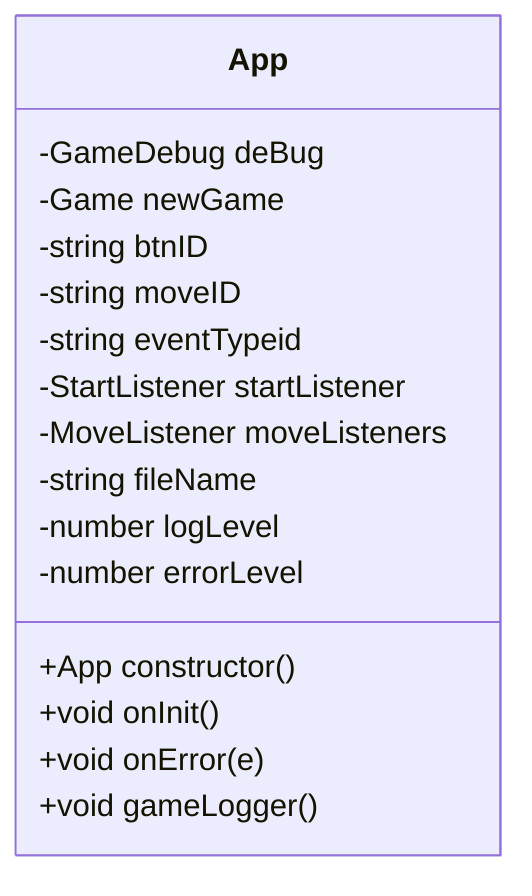

# Class: App: 0.4.1 2023/03/31

> - File: /lib/__App.js
> - Module: App
> - Export: App

## Design

-[x] All class properties are first class members

- [x] Most class properties have an initial default value
- ~~Constructor has parameters that are recommended values for X and O.~~
- [x] Constructor has parameters that are default values
- [x] Constructor has parameters that are optional values
- [s] Constructor and functions params without a optional value are mandatorty.
- [s] All classes have a dependency on GameDebug, which abstracts & wraps the console logging methods to various levels of logging information.
  - [x] Each method has an associated `log`or `check` params to toggle and inspect the function for debugging.
  - [z] This is a feature of the app, for improved developer experience.
  - [x] Same goes for `this.fileName` and associated `locname` paramer in each function as approprriate.
- [x] Constructor and functions may have `log` and `locname` parameters for tracing and logging purpose, which are optional, with default values.
- [x] Default values ae a defensive design against missing parameters, null conditions and undefined states, which were a debugging issue that led to this design decision..
- [x] Reduced the complexity of the constructor function
- [x] Hard coded values are minimised or moves to optiional parameters, when they repeat themselves more than once..

## Declaration

Class Diagram without logging and tracing

## Class Constructs and Instantiation

> Ignores the auxillary objects and properties used for tracing, logging and debugging for clarity.

### App v.0.4.0 2023/03/27

#### App Module

### App Class

### App Class Constructor

### App Class Methods

### App Logging

 method")
