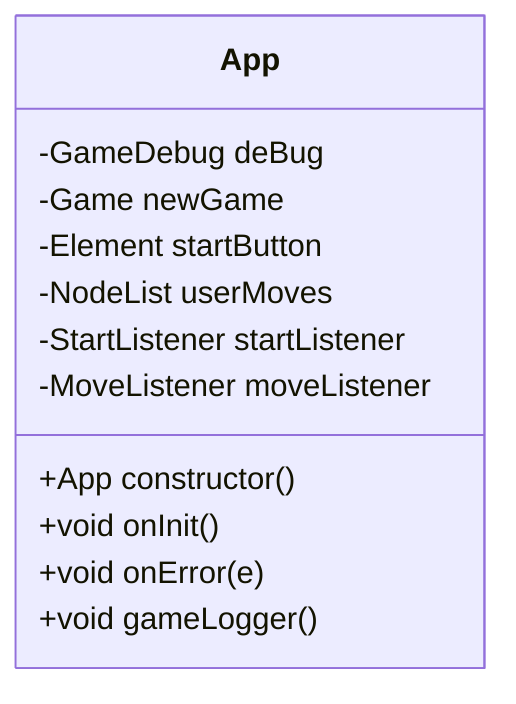
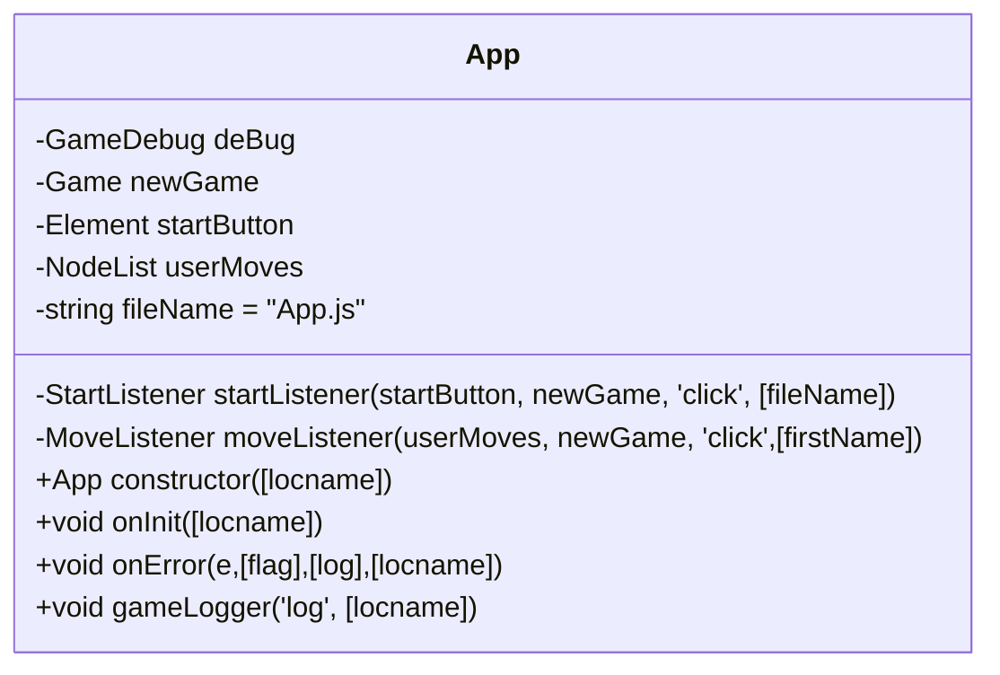
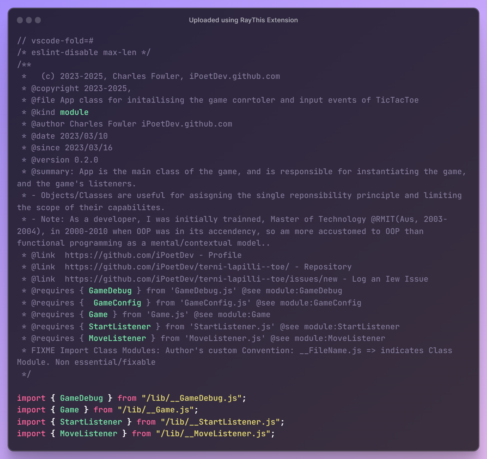
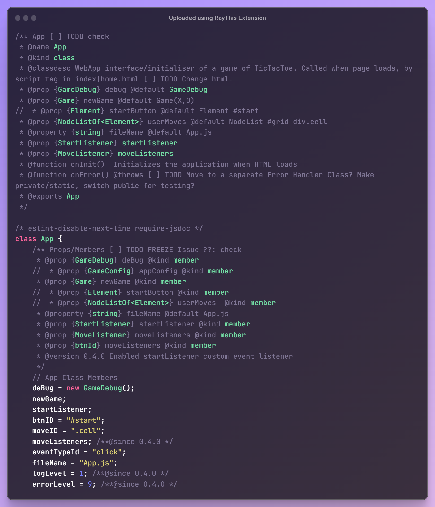
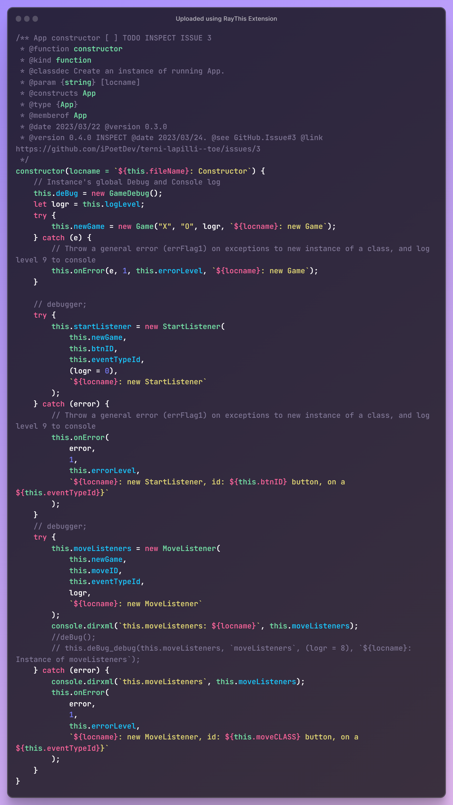
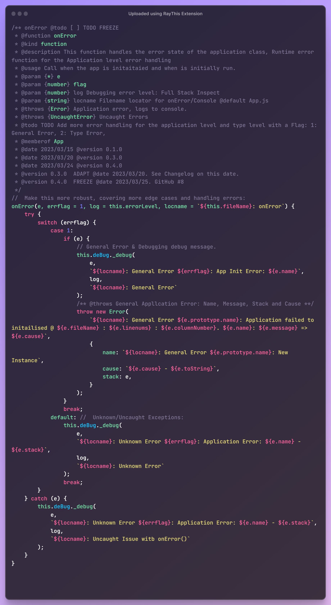
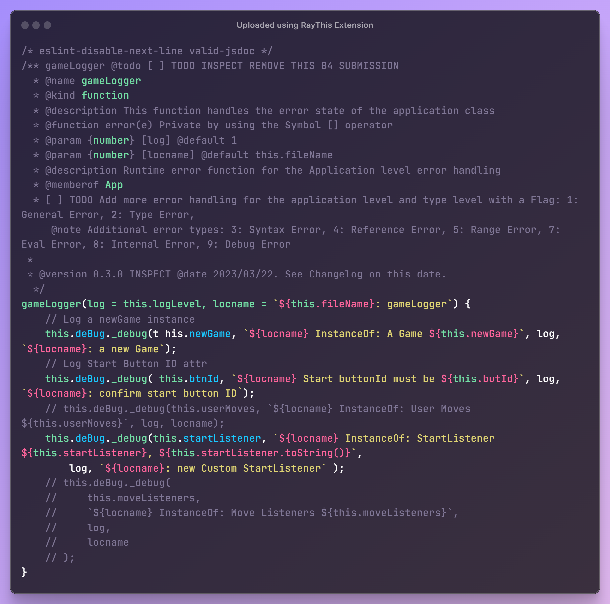
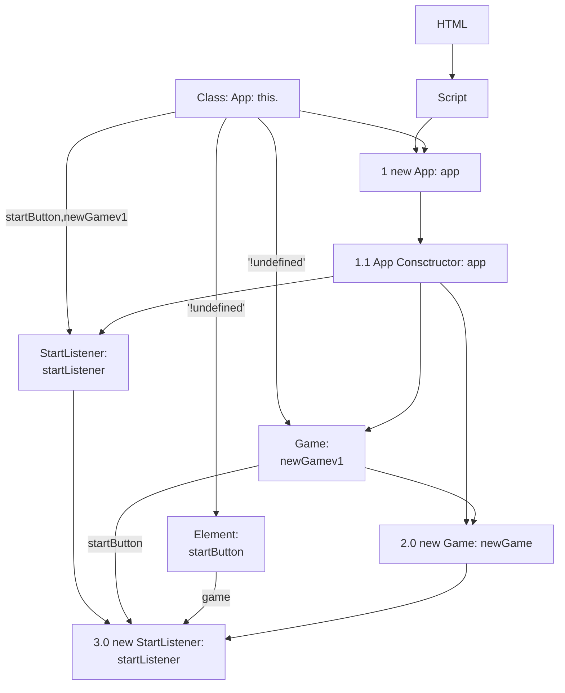

# Class: App

> - File: /lib/__App.js
> - Module: App
> - Export: App

## Design

- All class properties are first class members
- All class properties have an initial default value
- Constructor has parameters that are recommended values for X and O.
- Constructor has parameters that are default values
- Constructor has parameters that are optional values
- Constructor and functions params without a optional value are mandatorty.
- All classes have a dependency on GameDebug, which abstracts & wraps the console logging methods to various levels of logging information.
  - Each method has an associated `log`or `check` params to toggle and inspect the function for debugging.
  - This is a feature of the app, for improved developer experience.
  - Same goes for `this.fileName` and associated `locname` paramer in each function as approprriate.
- Constructor and functions have `log` and `locname` parameters for tracing and logging purpose, which are optional, with default values.
- Default values ae a defensive design against missing parameters, null conditions and undefined states, which were a debugging issue that led to this design decision.
  - Trade of is expensive initialisation of dependencies and member classes as objects that are never used.
  - Creates a potential ball of mud: which object is the current object in the call stack.
  - Reduced the complexity of the constructor function
- Hard coded values are minimised or moves to optiional parameters, when they repeat themselves more than once.
- Altrnatively they are extracted from inline referencing and placed in a `const`, a `let` or a `paramValueMap` object, if there is a bilateral choice and a default value.

## Declaration

Class Diagram without logging and tracing



Class Diagram with logging and tracing



## Class Constructs and Instantiation

> Ignores the auxillary objects and properties used for tracing, logging and debugging for clarity.

### App v.0.4.0 2023/03/27

#### App Module



### App Class



### App Class Constructor



### App Class Methods



### App Logging


 method"

### App v0.3.0 2023/03/23

#### StartListener only

> MoveListener not included for being identical and  repeatious, so subsitute.

```ruby
graph TD
  HTML --> Script
  Script --> 1.0[1 new App: app]
  this --> 1.0
  this --'!undefined'--> this.1[Game: \n newGamev1]
  this --'!undefined'-->  this.2[Element: \n startButton]
  this --startButton,newGamev1--> this.4[StartListener: \n startListener]
  1.0 --> 1.1[1.1 App Consctructor: app]
  1.1 --> this.1
  1.1 --> this.4
  1.1 ----> 2[2.0 new Game: newGame]
  this.1 --> 2
  this.4 -->  3
  this.1 --startButton--> 3[3.0 new StartListener: \n startListener]
  this.2 --game--> 3[3.0 new StartListener: \n startListener]
  2 --> 3

```


