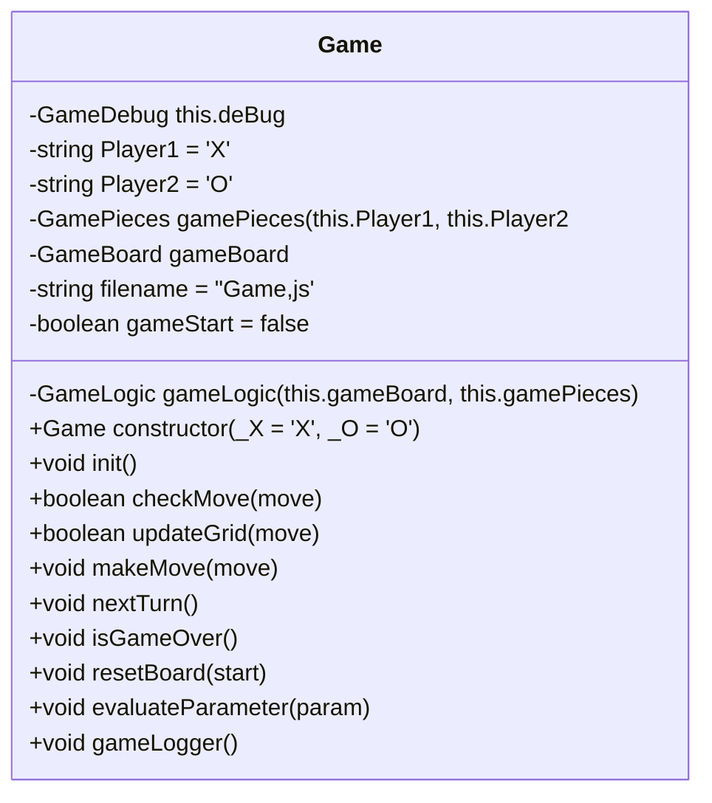
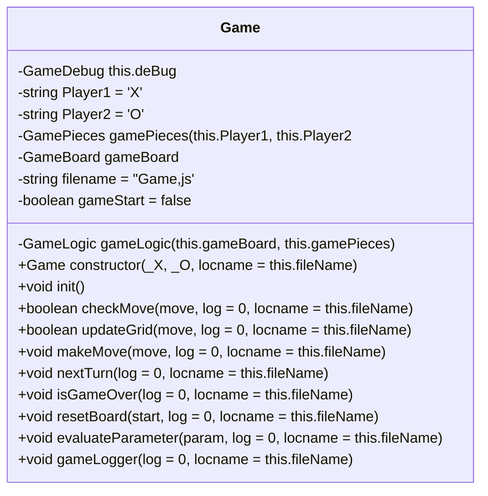
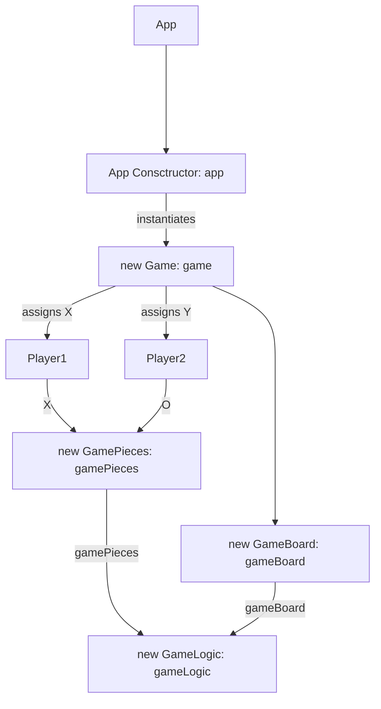
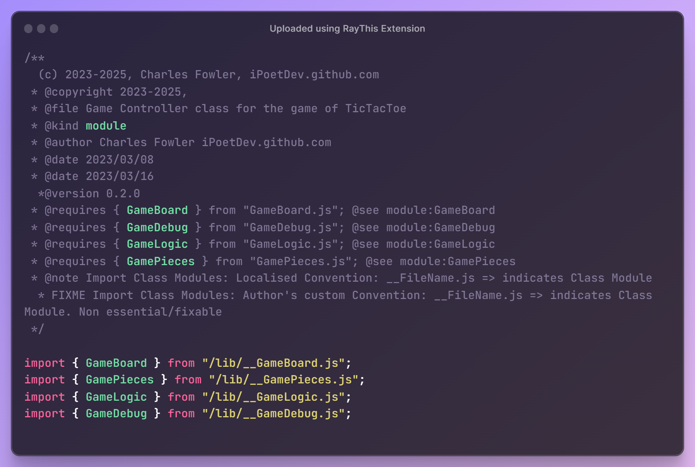
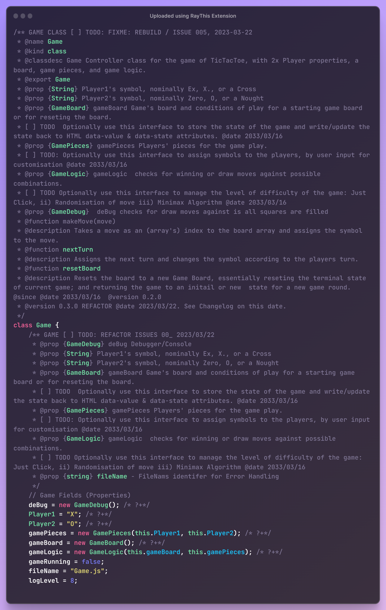
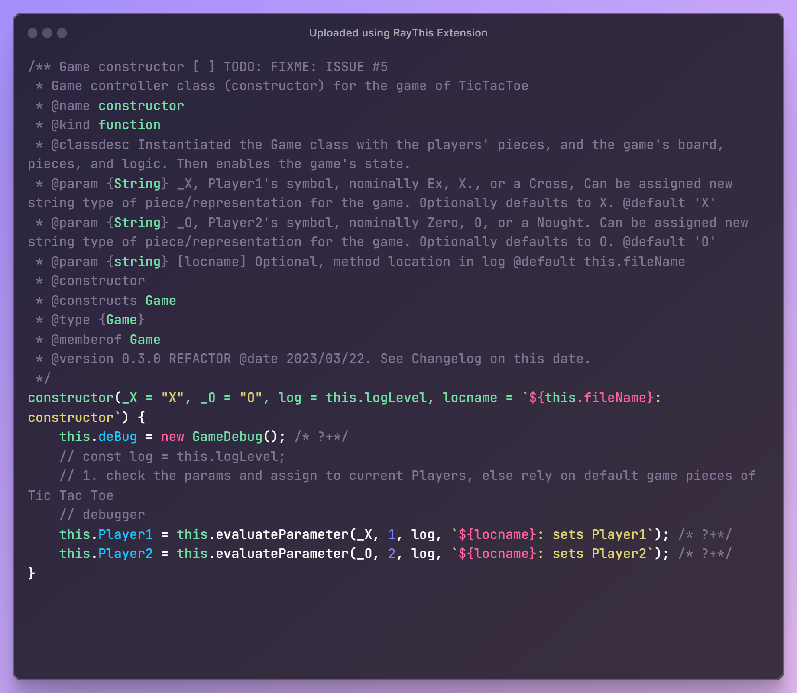
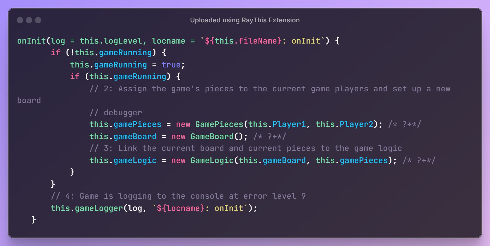
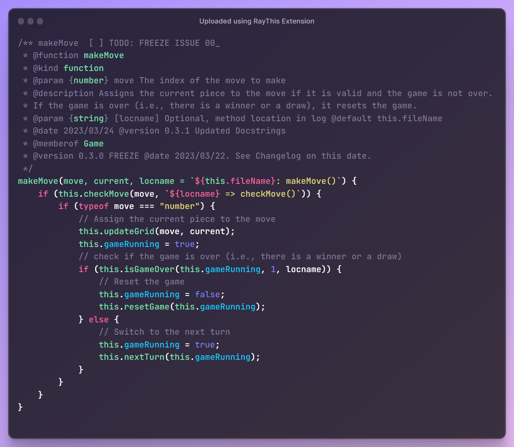
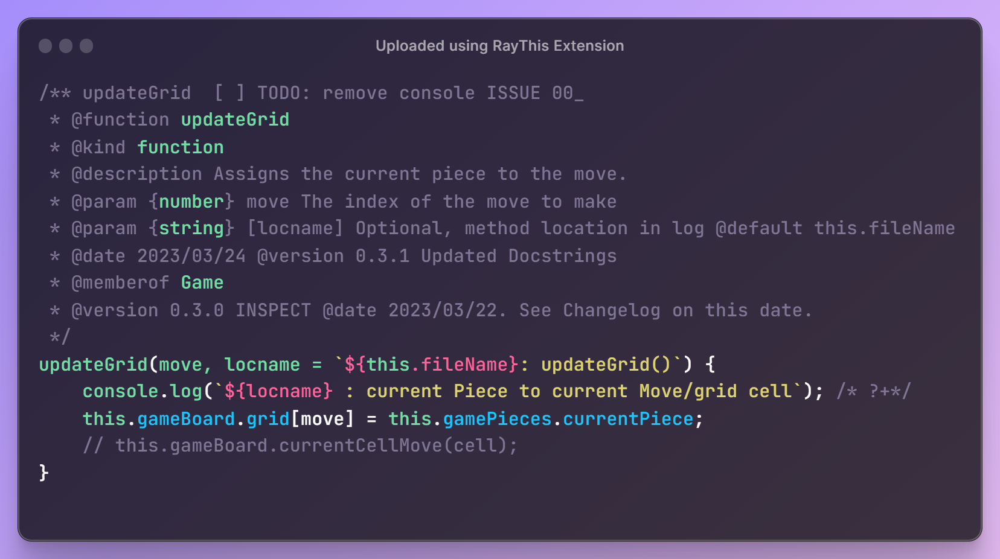
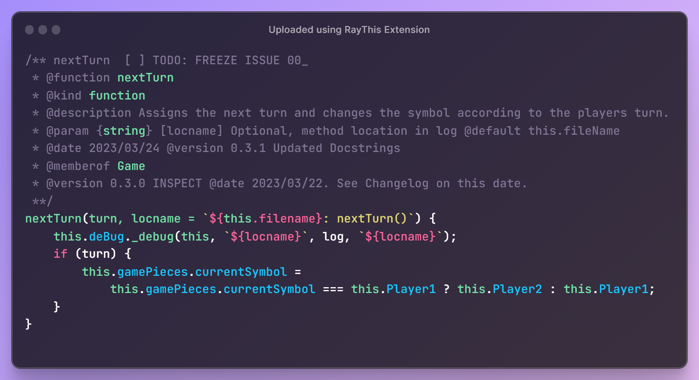

# Class: Game

> - File: /lib/__Game.js
> - Module: Game
> - Export: Game

## Design

### Construction

- All class properties are first class members
- All class properties have an initial default value
- Constructor has parameters that are recommended values for X and O.
- Constructor has parameters that are default values
- Constructor has parameters that are optional values
- Constructor and functions have `log` and `locname` parameters for tracing and logging purpose, which are optional, with default values.
- Constructor and functions params without a optional value are mandatorty.
- All classes have a dependency on GameDebug, which abstracts & wraps the console logging methods to various levels of logging information.
  - Each method has an associated `log`or `check` params to toggle and inspect the function for debugging.
  - This is a feature of the app, for improved developer experience.
  - Same goes for `this.fileName` and associated `locname` paramer in each function as approprriate.
- Default values ae a defensive design against missing parameters, null conditions and undefined states, which were a debugging issue that led to this design decision.
  - Trade of is expensive initialisation of dependencies and member classes as objects that are never used.
  - Creates a potential ball of mud: which object is the current object in the call stack.
  - Reduced the complexity of the constructor function
- Hard coded values are minimised or moves to optiional parameters, when they repeat themselves more than once.
- Altrnatively they are extracted from inline referencing and placed in a `const`, a `let` or a `paramValueMap` object, if there is a bilateral choice and a default value.

### Solution

- Is loosely coupled with the UI Listener when there is a 1 to 1 relation between a game and 1 type of UI event.
  - Question: how to handle many types of user events, many sources, for each game instance
- Is not tighly coupled with the internal mechanic of the caller method, as Game's internal state (machine) can be switched  with little or light changes to program flow and logic
- Uses a deterministic finitie state machine of string states, via named CONSTANTS variables and as value CONSTANTS, via the keyword const for immutablity.

### Enchancements

#### Computer Science

- Employ an Observer Pattern (Pub & Sub) for handling different user input events from UI
- Employ a full state machine to handle the output of user input events for UI interactions
- Employ a full state machine to handle the output/transactions of game play/state
- Employ a full state machine to handle the output/transactions of a game's inividual (to many) move's play/state
- Employ simple randomisation algortims for random moves for medium difficulty by a computer opponent
- Employ the minimax  algortims for higher difficulty leve by a computer opponent

#### User Features

> Not all implemented,

- User uses a mouse as user input (event). *As-Is* - UI
- User uses a keyboard as a user input (event). *<ins>ToBe</ins>* - UI
- User uses a pointer (click or touch) as user input (event). - *<ins>ToBe</ins>* - UI
- Game handles multiple user input types as full scoped interactions. *<ins>ToBe</ins>* - Controller
- Game handles different levels of difficult and switching between such. - *<ins>ToBe</ins>*  - Controller
- Game handles finite game states. *As-Is*  - Controller
- Game handles finite move states. *As-Is*  - Controller
- Game handles finite result/outcome states. *As-Is*   - Controller
- Game handles interupts states, like pause and error states.  *As-Is*
- Game/App handles start, restart, reset, exit states. *<ins>ToBe</ins>* - Controller/App
- Game handles async states for remote two players, two devices. *<ins>ToBe</ins>*- Controller/Network
- Game handles data storage, retrieval and validation states as game data state. *<ins>ToBe</ins>* - Controller/Data

## Description

Class Diagram without logging and tracing



Class Diagram with logging and tracing



## Class Constructs and Instantiation

> Ignores the auxillary objects and properties used for tracing, logging and debugging for clarity.

```ruby
graph TD
  1.0[App] ----> 1.1[App Consctructor: app]
  1.1 --instantiates--> 2[new Game: game]
  2 --assigns X--> 2.0.1[Player1]
  2 --assigns Y--> 2.0.2[Player2]
  2.0.1 --"X"--> 2.0.3[new GamePieces: gamePieces]
  2.0.2 --"O"--> 2.0.3
  2 ----> 2.0.4[new GameBoard: gameBoard]
  2.0.3 ----> 2.0.5[new GameLogic: gameLogic]
  2.0.4 ----> 2.0.5
```



### App Snap

















