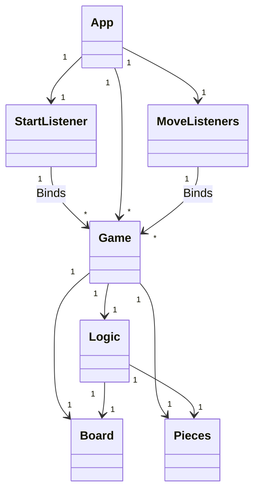

# Game Play

## Class Diagram

```mermaid
  classDiagram
    App "1" --> "1" StartListener
    StartListener "1" --> "*" Game : Binds
    App "1" --> "*" Game
    App "1" --> "1" MoveListeners
    MoveListeners "1" --> "*" Game :Binds
    Game "1" --> "1" Logic
    Game "1" --> "1" Board
    Logic "1" --> "1" Board
    Game "1" --> "1" Pieces
    Logic "1" --> "1" Pieces
```

### Game Moves on Click

