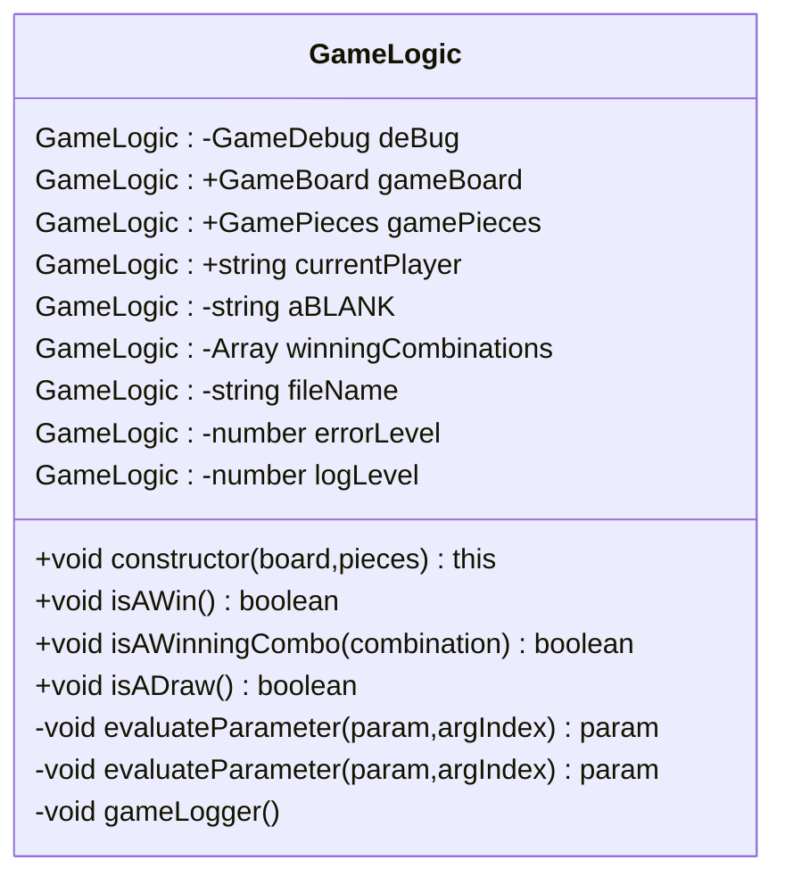
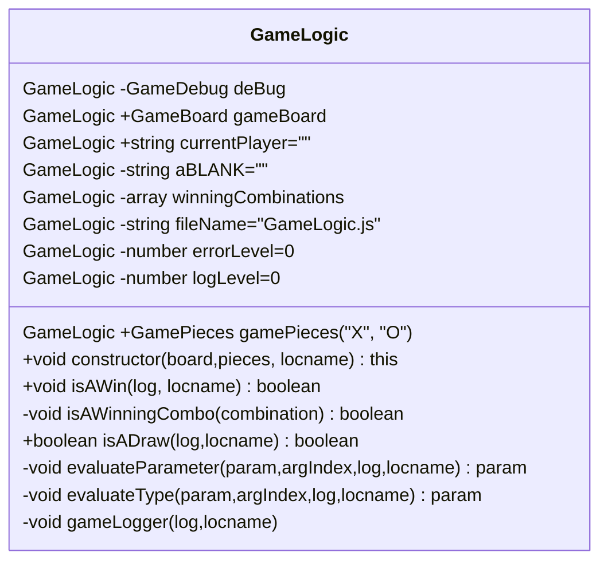

# Class: GameLogic

> - File: /lib/__GameLogic.js
> - Module: GameLogic
> - Export: GameLogic
>

## Design

- All class properties are first class members
- All class properties have an initial default value
- Constructor has parameters that are recommended values for X and O.
- Constructor has parameters that are default values
- Constructor has parameters that are optional values
- Constructor and functions have `log` and `locname` parameters for tracing and logging purpose, which are optional, with default values.
- Constructor and functions params without a optional value are mandatorty.
- All classes have a dependency on GameDebug, which abstracts & wraps the console logging methods to various levels of logging information.
  - Each method has an associated `log`or `check` params to toggle and inspect the function for debugging.
  - This is a feature of the app, for improved developer experience.
  - Same goes for `this.fileName` and associated `locname` paramer in each function as approprriate.
- Default values ae a defensive design against missing parameters, null conditions and undefined states, which were a debugging issue that led to this design decision.
  - Trade of is expensive initialisation of dependencies and member classes as objects that are never used.
  - Creates a potential ball of mud: which object is the current object in the call stack.
  - Reduced the complexity of the constructor function
- Hard coded values are minimised or moves to optiional parameters, when they repeat themselves more than once.
- Altrnatively they are extracted from inline referencing and placed in a `const`, a `let` or a `paramValueMap` object, if there is a bilateral choice and a default value.

## Declaration

Class Diagram without logging and tracing

Class Diagram with logging and tracing

