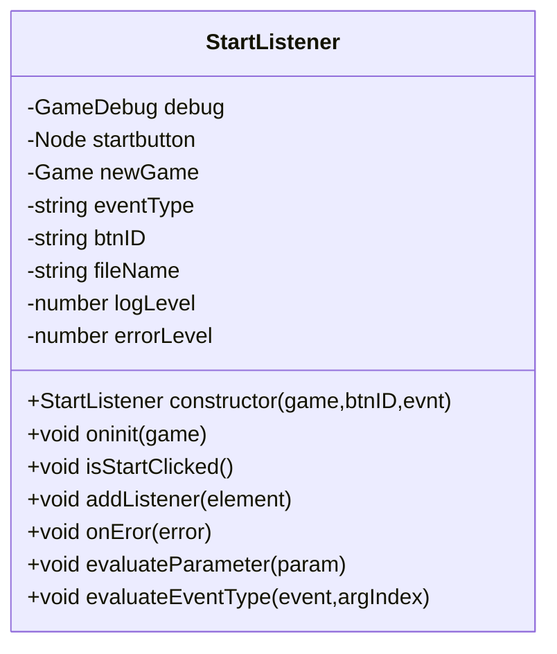
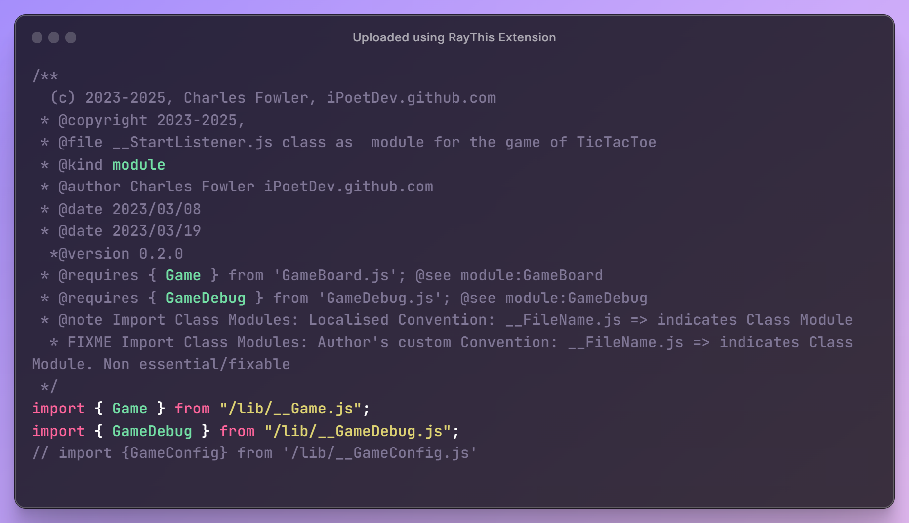
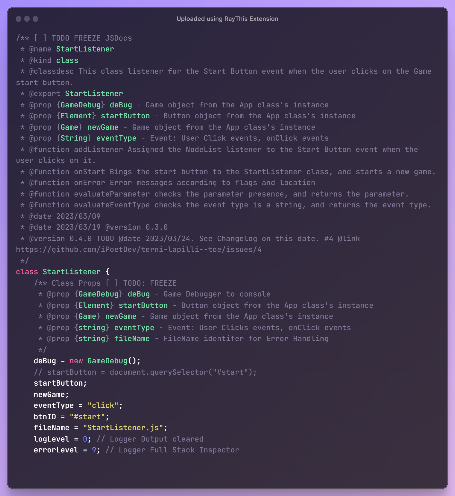
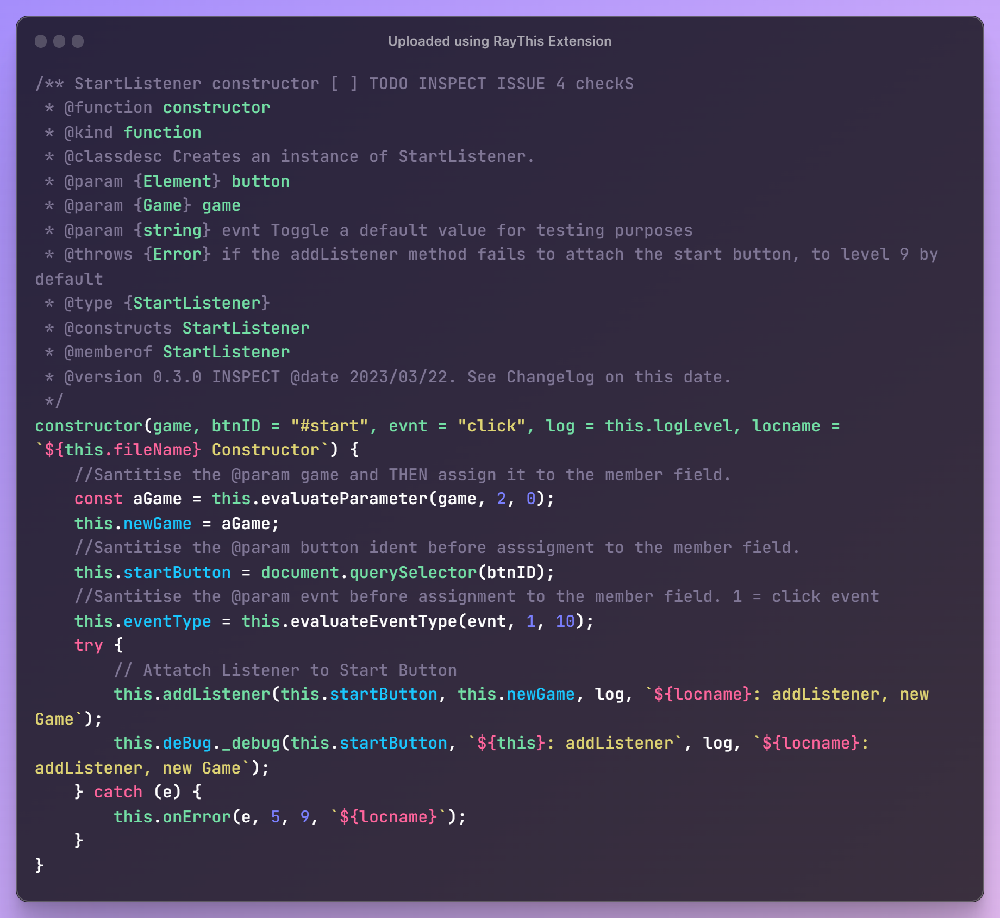
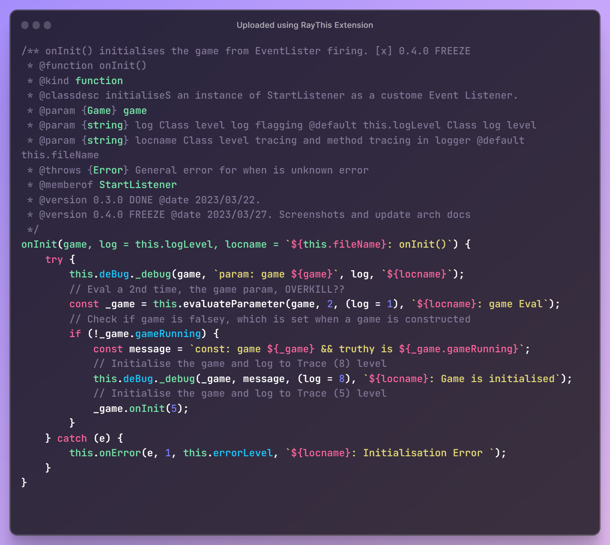
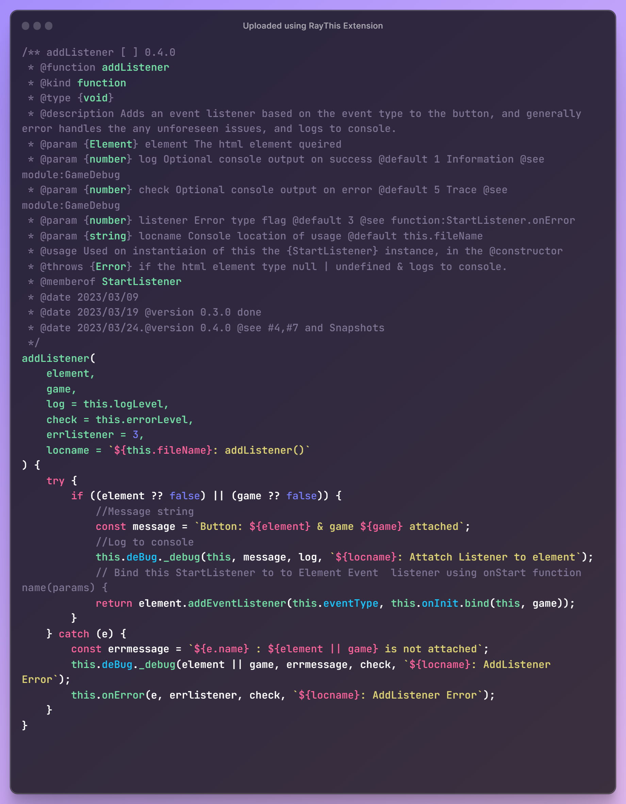
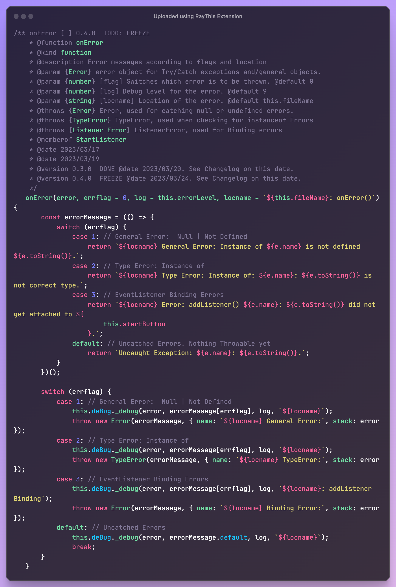
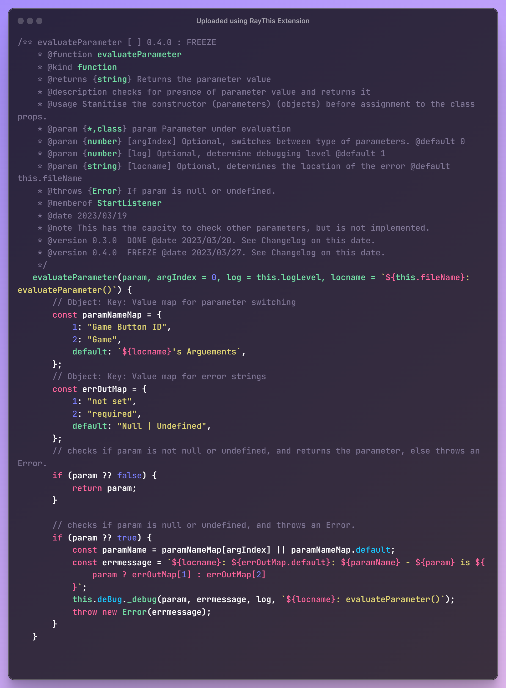
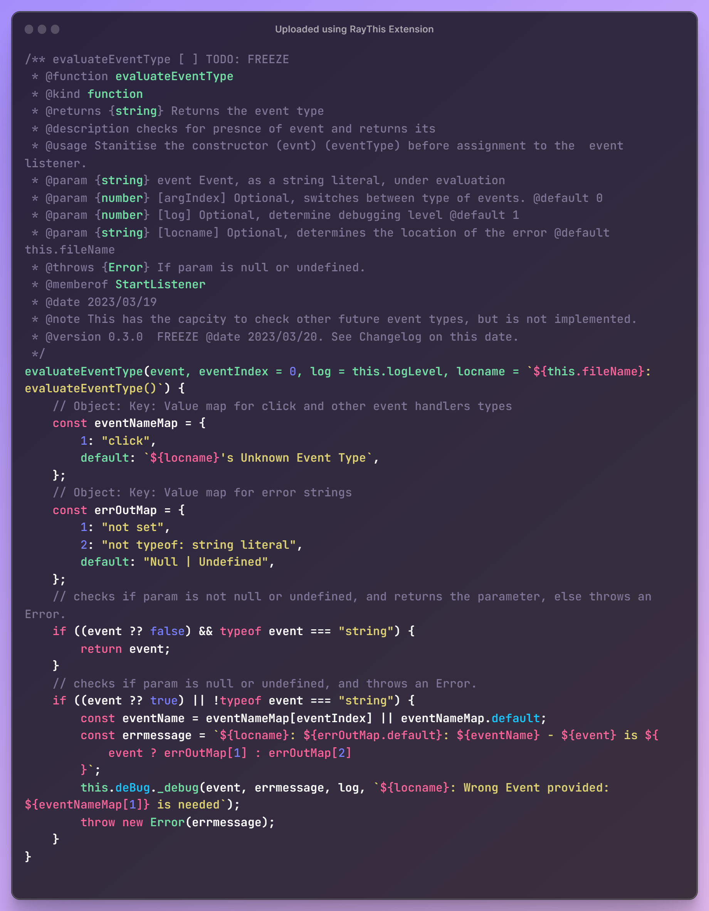

# Class: StartListener

> - File: /lib/__StartListener.js
> - Module: StartListener
> - Export: StartListener
> - Imported By: __App.js
> - Depends: __Game.js
> - Depends: __GameDebug.js

## Design

- [x] All class properties are first class members
- [x]  Some class properties have an initial default value
- [x] Constructor has parameters that are default values
- [x] Constructor has parameters that are optional values
- [x]  Constructor and functions have `log` and `locname` parameters for tracing and logging purpose, which are optional, with default values.
- [x] Constructor and functions params without a optional value are mandatorty.
- [x] All classes have a dependency on GameDebug, which abstracts & wraps the console logging methods to various levels of logging information.
- [x]  Default values ae a defensive design against missing parameters, null conditions and undefined states, which were a debugging issue that led to this design decision.
- [x]  Hard coded values are minimised or moves to optiional parameters, when they repeat themselves more than once.
- [x] Alterrnatively they are extracted from inline referencing and placed in a `const`, a `let` or a `paramValueMap` object, if there is a bilateral choice and a default value.

## Declaration

Class Diagram without logging and tracing

### Snapshots v0.4.0

#### Module

#### Class declaration and properties

#### constructor

#### onInit

#### addListener

#### onError

#### evaluateParameter

#### evaluateEventType

