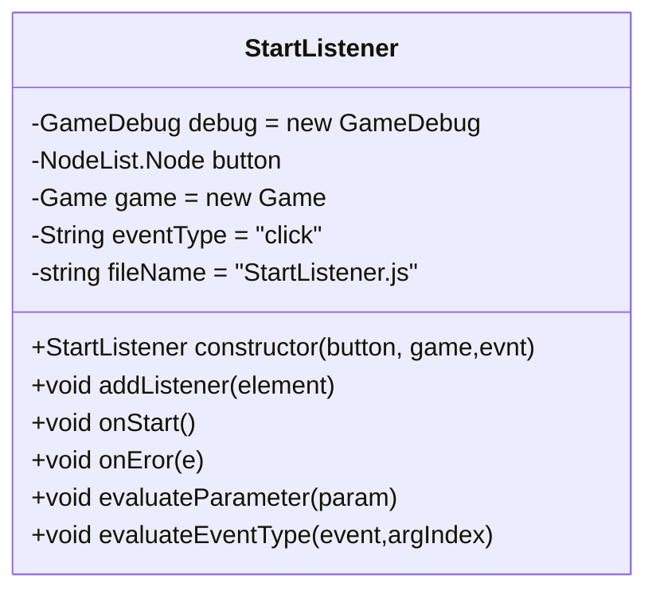
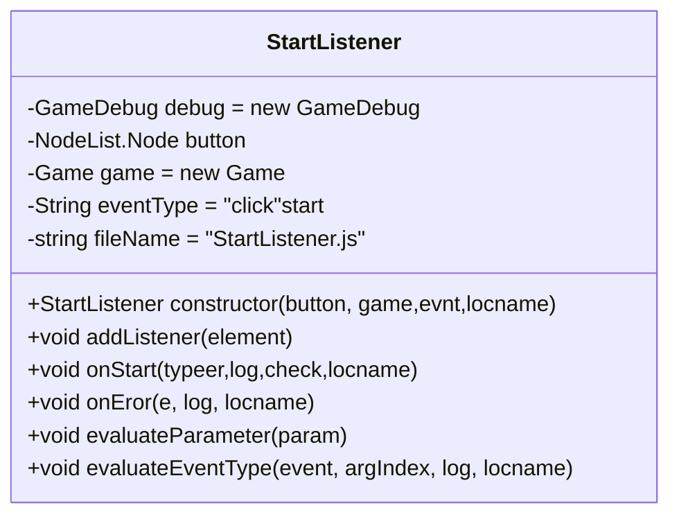
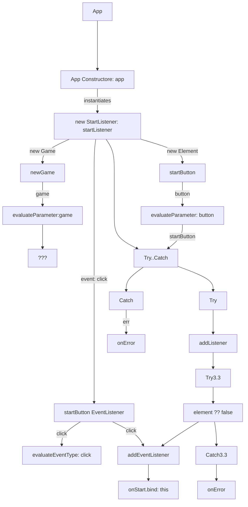

# Class: StartListener

> - File: /lib/__StartListener.js
> - Module: StartListener
> - Export: StartListener
> - Imported By: __App.js
> - Depends: __Game.js
> - Depends: __GameDebug.js

## Design

- All class properties are first class members
- All class properties have an initial default value
- Constructor has parameters that are recommended values for X and O.
- Constructor has parameters that are default values
- Constructor has parameters that are optional values
- Constructor and functions have `log` and `locname` parameters for tracing and logging purpose, which are optional, with default values.
- Constructor and functions params without a optional value are mandatorty.
- All classes have a dependency on GameDebug, which abstracts & wraps the console logging methods to various levels of logging information.
  - Each method has an associated `log`or `check` params to toggle and inspect the function for debugging.
  - This is a feature of the app, for improved developer experience.
  - Same goes for `this.fileName` and associated `locname` paramer in each function as approprriate.
- Default values ae a defensive design against missing parameters, null conditions and undefined states, which were a debugging issue that led to this design decision.
  - Trade of is expensive initialisation of dependencies and member classes as objects that are never used.
  - Creates a potential ball of mud: which object is the current object in the call stack.
  - Reduced the complexity of the constructor function
- Hard coded values are minimised or moves to optiional parameters, when they repeat themselves more than once.
- Altrnatively they are extracted from inline referencing and placed in a `const`, a `let` or a `paramValueMap` object, if there is a bilateral choice and a default value.

## Declaration

Class Diagram without logging and tracing



Class Diagram with logging and tracing



## Class Constructs and Instantiation

> Ignores the auxillary objects and properties used for tracing, logging and debugging for clarity.

```ruby
graph TD
 1.0[App] ----> 1.1[App Constructore: app]
  1.1 --instantiates--> 3[new StartListener: startListener]
  3--new Element--> this.3.0.1[startButton]
  3--new Game--> this.3.0.2[newGame]
  3--event: click--> this.3.0.3[startButton EventListener]
  this.3.0.1 --button--> 3.4.1[evaluateParameter: button]
  this.3.0.2 --game--> 3.4.2[evaluateParameter:game]
  3.4.2 --> ???
  this.3.0.3 --click--> 3.5[evaluateEventType: click]
  3 -->3.2[Try..Catch]
  3.2 -->Try
  3.4.1 --startButton-->3.2
  Try -->3.3[addListener]
  3.2 -->Catch
  Catch --err-->3.7[onError]
  3.3-->Try3.3
  Try3.3-->3.3.1[element ?? false]
  this.3.0.3 --click-->3.3.2
  3.3.1-->3.3.2[addEventListener]
  3.3.2-->3.3.4[onStart.bind: this]
  3.3.1-->Catch3.3
  Catch3.3-->3.3.3[onError]

```



>> Comment: So this implementation of Custom StartListener binds to it own start function but never initialises the game

- The code is functional but inoperative.

- Next step > Refactor and Improve the Code.
